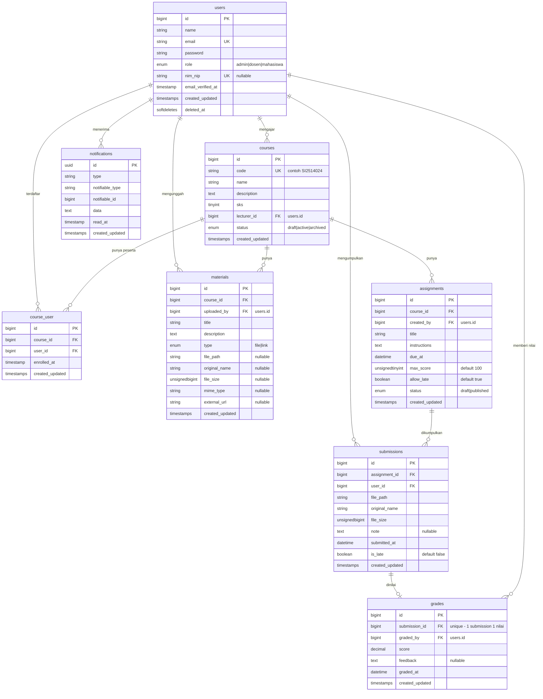

# SPESIFIKASI PROYEK — "KampusLMS"

**Mata Kuliah:** SI2514024 — Pemrograman Web (3 SKS, Semester 5)
**Model:** Project-Based Learning, tema seragam, kelompok 4 orang (66 mahasiswa — Kelas A 9 kelompok, Kelas B 7 kelompok)
**Stack wajib:** Laravel 12, MySQL/MariaDB, Blade (minggu 1–6) → jalur frontend bebas setelah minggu 6
**Dokumen ini adalah kontrak proyek.** Skema database dan kontrak API bersifat WAJIB dan tidak boleh diubah tanpa persetujuan dosen.

> **Cara membaca rujukan.** Dokumen ini dirujuk dari modul mingguan dengan sebutan "Bagian 4", "Bagian 4.3", dan seterusnya — angkanya mengacu ke nomor bagian pada dokumen ini.

> **Istilah asing?** Buka [lampiran/A-glosarium.md](lampiran/A-glosarium.md) saat perlu, tidak usah dibaca berurutan.

---

## 1. Latar Belakang & Sasaran

Banyak kampus masih memakai Moodle apa adanya: berat, sulit dikustomisasi, dan tidak menyatu dengan sistem akademik kampus. Proyek ini membangun **LMS ringan berbasis Laravel 12** yang menangani alur inti perkuliahan: pengelolaan mata kuliah, distribusi materi, pengumpulan tugas, penilaian, dan notifikasi.

Sasaran akhir: setiap kelompok menghasilkan aplikasi web yang **fungsional, aman, dan ter-deploy di domain publik** pada minggu ke-16.

> **Catatan penting:** proyek ini dimulai minggu ke-1 dan dikerjakan bertahap sepanjang semester. Tidak ada latihan terpisah — semua praktikum mingguan adalah pengerjaan proyek ini.

---

## 2. Ruang Lingkup

### 2.1 Fitur Wajib (sama untuk semua kelompok)

| # | Modul | Deskripsi minimum |
|---|-------|-------------------|
| F1 | Autentikasi & Role | Login/logout. 3 role: `admin`, `dosen`, `mahasiswa`. Middleware pembatas akses. |
| F2 | Manajemen Pengguna | Admin dapat CRUD pengguna dan menetapkan role. |
| F3 | Mata Kuliah | Admin CRUD mata kuliah. Dosen ditugaskan ke mata kuliah. |
| F4 | Enrollment | Admin/dosen mendaftarkan mahasiswa ke mata kuliah. Mahasiswa hanya melihat MK yang diikutinya. |
| F5 | Materi | Dosen unggah materi (PDF/PPTX/link). Mahasiswa mengunduh. |
| F6 | Tugas | Dosen membuat tugas dengan deadline. Mahasiswa mengumpulkan berkas. Status: belum / terkumpul / terlambat. |
| F7 | Penilaian | Dosen memberi nilai + feedback pada pengumpulan. Mahasiswa melihat nilainya sendiri. |
| F8 | Rekap Nilai | Halaman rekap nilai per mata kuliah (dosen) dan per mahasiswa (mahasiswa). |
| F9 | Notifikasi | Notifikasi in-app saat tugas baru dibuat dan saat nilai keluar. Diproses via queue. |
| F10 | Dashboard | Ringkasan sesuai role (tugas mendekati deadline, pengumpulan belum dinilai, dll). |

### 2.2 Fitur Diferensiasi (pilih **1** per kelompok)

Dipilih pada minggu ke-3 dan didaftarkan ke dosen. **Satu fitur maksimal dipilih oleh 1 kelompok di dalam kelas yang sama** — pendaftaran dilayani berdasarkan urutan masuk, jadi putuskan lebih awal. Kelompok di Kelas A dan Kelas B boleh memilih fitur yang sama; keduanya tidak saling mereview dan tidak diuji bersama.

1. Forum diskusi per mata kuliah (thread + reply)
2. Kuis pilihan ganda dengan penilaian otomatis & batas waktu
3. Presensi kelas berbasis kode/QR dengan masa berlaku
4. Analitik keaktifan mahasiswa (grafik pengumpulan, keterlambatan, tren nilai)
5. Sertifikat penyelesaian mata kuliah (generate PDF)
6. Kalender akademik & ekspor jadwal tugas (.ics)
7. Pengumuman broadcast + notifikasi email
8. Impor/ekspor data mahasiswa & nilai (CSV/XLSX)
9. Rubrik penilaian bertingkat: dosen menyusun kriteria berbobot, nilai dihitung otomatis dari rubrik
10. Bank soal & penugasan acak: tiap mahasiswa mendapat variasi soal dari satu bank
11. Pelacakan revisi tugas: mahasiswa mengumpulkan ulang, seluruh versi tersimpan dan dapat dibandingkan
12. Katalog mata kuliah publik + pendaftaran mandiri dengan persetujuan dosen
13. Ekspor transkrip nilai per mahasiswa (PDF) beserta rekap kehadiran tugas
14. Papan peringkat & lencana pencapaian berbasis ketepatan waktu pengumpulan
15. Jadwal sesi kuliah per mata kuliah beserta ruang, dengan deteksi bentrok jadwal
16. Pengajuan keterangan terlambat/berhalangan oleh mahasiswa, disetujui atau ditolak dosen, dan berpengaruh pada status pengumpulan
17. Kurasi sumber belajar tambahan per mata kuliah, dengan penanda "sudah dibaca" per mahasiswa
18. Bank umpan balik dosen: komentar penilaian yang sering dipakai disimpan dan dapat dipilih ulang saat menilai

**Ketentuan tambahan:** fitur diferensiasi wajib menambahkan **minimal satu tabel baru** di luar skema Bagian 4, dan **tidak boleh mengubah tabel atau kolom yang sudah ada** di Bagian 4. Keduanya disengaja: tabel tambahan membuat basis kode tiap kelompok benar-benar berbeda sejak minggu 3, sementara skema inti yang tak tersentuh membuat uji keamanan saat UTS dan UAS berlaku sama untuk semua kelompok.

### 2.3 Di Luar Lingkup (JANGAN dikerjakan)

Video conference, pembayaran, chat realtime antar pengguna, mobile app native, mikroservis, multi-tenant. Menambah fitur di luar lingkup **tidak menambah nilai** dan biasanya menurunkan kualitas fitur wajib.

---

## 3. Peran & Hak Akses

| Aksi | Admin | Dosen | Mahasiswa |
|------|:-----:|:-----:|:---------:|
| CRUD pengguna & role | ✔ | — | — |
| CRUD mata kuliah | ✔ | — | — |
| Kelola enrollment | ✔ | ✔ (MK sendiri) | — |
| CRUD materi | ✔ | ✔ (MK sendiri) | lihat/unduh |
| CRUD tugas | ✔ | ✔ (MK sendiri) | lihat |
| Mengumpulkan tugas | — | — | ✔ (MK yang diikuti) |
| Memberi nilai | — | ✔ (MK sendiri) | — |
| Melihat nilai orang lain | ✔ | ✔ (MK sendiri) | ✘ |

**Aturan keamanan yang akan diuji saat interview:**
- Mahasiswa A **tidak boleh** mengakses submission mahasiswa B, termasuk dengan menebak URL/ID.
- Dosen **tidak boleh** menyentuh data mata kuliah yang bukan miliknya.
- File materi/submission **tidak boleh** dapat diunduh oleh pengguna yang tidak berhak (jangan simpan di `storage/app/public` untuk file bernilai privat).

---

## 4. Skema Database (WAJIB)

### 4.1 Diagram Relasi



### 4.2 Constraint & Index Wajib

| Tabel | Ketentuan |
|-------|-----------|
| `users` | `email` unique; `nim_nip` unique nullable; index pada `role` |
| `courses` | `code` unique; FK `lecturer_id` → `users.id` `restrictOnDelete` |
| `course_user` | **unique composite** (`course_id`, `user_id`) — cegah enroll ganda |
| `materials` | FK `course_id` `cascadeOnDelete`; index `course_id` |
| `assignments` | FK `course_id` `cascadeOnDelete`; index (`course_id`, `due_at`) |
| `submissions` | **unique composite** (`assignment_id`, `user_id`) — 1 mahasiswa 1 submission aktif |
| `grades` | `submission_id` **unique** — relasi one-to-one |

Semua migrasi **wajib reversible** (`down()` benar-benar mengembalikan keadaan). Ini diuji.

### 4.3 Relasi Eloquent yang Diharapkan

Nama method relasi ikut ditetapkan, karena dipakai di modul, di soal interview, dan di skrip pengujian.

```
User      : taughtCourses()  hasMany(Course, 'lecturer_id')
            courses()        belongsToMany(Course)->withPivot('enrolled_at')->withTimestamps()
            submissions()    hasMany(Submission)
            gradesGiven()    hasMany(Grade, 'graded_by')

Course    : lecturer()       belongsTo(User, 'lecturer_id')
            students()       belongsToMany(User)->withPivot('enrolled_at')->withTimestamps()
            materials()      hasMany(Material)
            assignments()    hasMany(Assignment)

Assignment: course()         belongsTo(Course)
            submissions()    hasMany(Submission)
            grades()         hasManyThrough(Grade, Submission)

Submission: assignment()     belongsTo(Assignment)
            student()        belongsTo(User, 'user_id')
            grade()          hasOne(Grade)

Grade     : submission()     belongsTo(Submission)
            grader()         belongsTo(User, 'graded_by')
```

⚠️ Perhatikan `->withPivot('enrolled_at')`. Tanpa itu kolom `enrolled_at` yang diwajibkan pada tabel `course_user` tidak akan pernah terbaca maupun terisi lewat relasi — dan ini termasuk yang diperiksa saat penilaian Tugas 1.

### 4.4 Seeder Wajib

Agar penilaian konsisten, seeder harus menghasilkan **minimal**:
- 1 admin, 3 dosen, 30 mahasiswa
- 5 mata kuliah, tiap MK ≥ 15 mahasiswa terdaftar
- 3 tugas per MK, dengan campuran: sudah lewat deadline, aktif, dan draft
- ≥ 100 submission, ~60% di antaranya sudah dinilai

Data sebanyak ini **disengaja** — tanpa volume, N+1 query di minggu 11 tidak akan terasa.

Akun demo wajib (untuk penguji):
```
admin@kampuslms.test     / password
dosen@kampuslms.test     / password
mahasiswa@kampuslms.test / password
```

**Akun demo di server produksi.** Alamat surel di atas tetap dipakai supaya penguji dan CI tidak perlu menebak, tetapi **kata sandinya wajib diganti** saat deployment. Sediakan seeder terpisah untuk itu:

```bash
php artisan db:seed --class=DemoAccountSeeder --force
```

Kata sandi produksi ditulis di `docs/deployment.md` (yang boleh dibaca penguji), **bukan** di `README.md` yang terbuka untuk umum. Ini menyelesaikan pertentangan antara "akun demo harus dapat dipakai penguji" dan daftar periksa keamanan minggu 12.

---

## 5. Kontrak API (WAJIB — dipakai mulai minggu 6)

Prefix `/api/v1`. Autentikasi: Laravel Sanctum (Bearer token). Semua response dibungkus API Resource.

| Method | Endpoint | Akses | Keterangan |
|--------|----------|-------|------------|
| POST | `/auth/login` | publik | mengembalikan token |
| POST | `/auth/logout` | auth | |
| GET | `/me` | auth | profil + role |
| GET | `/courses` | auth | dosen: MK yang diajar; mahasiswa: MK yang diikuti |
| GET | `/courses/{id}` | auth+scope | detail + jumlah materi/tugas |
| GET | `/courses/{id}/materials` | auth+scope | |
| GET | `/courses/{id}/assignments` | auth+scope | mendukung `?status=`, `?page=` |
| POST | `/assignments` | dosen | |
| PUT/PATCH | `/assignments/{id}` | dosen (pemilik) | |
| DELETE | `/assignments/{id}` | dosen (pemilik) | |
| GET | `/assignments/{id}/submissions` | dosen (pemilik) | |
| POST | `/assignments/{id}/submissions` | mahasiswa (terdaftar) | multipart, `file` |
| PUT | `/submissions/{id}/grade` | dosen (pemilik) | `score`, `feedback` — *upsert*, aman dipanggil berulang |
| GET | `/notifications` | auth | |
| POST | `/notifications/{id}/read` | auth | |

**Format response wajib:**

```json
// sukses (koleksi)
{ "data": [ ... ], "meta": { "current_page": 1, "last_page": 5, "total": 47 } }

// sukses (tunggal)
{ "data": { ... } }

// error validasi — 422
{ "message": "Data yang diberikan tidak valid.", "errors": { "score": ["..."] } }

// tidak berhak — 403
{ "message": "Anda tidak memiliki akses ke sumber daya ini." }
```

`PUT /submissions/{id}/grade` memakai `updateOrCreate` karena `grades.submission_id` bersifat unique — penilaian ulang oleh dosen adalah hal yang wajar, dan dengan `POST` panggilan kedua akan melanggar constraint. Kembalikan **201** saat nilai dibuat pertama kali dan **200** saat diperbarui.

Kontrak ini seragam sehingga **jalur frontend apa pun (Blade, Inertia+Vue/React, SPA Svelte) dinilai dengan rubrik yang sama.**

---

## 6. Jalur Frontend

| Periode | Ketentuan |
|---------|-----------|
| Minggu 1–6 | **Wajib Blade polos.** Alpine.js boleh dipakai untuk interaksi kecil, tetapi tidak diwajibkan dan tidak dinilai. Tujuannya agar fokus di konsep backend, bukan di *build tooling*. |
| Minggu 7–16 | Kelompok memilih **satu** jalur dan mendaftarkannya: (a) tetap Blade, (b) Blade + Livewire 3, (c) Inertia 2 + Vue/React/Svelte, (d) SPA terpisah yang mengonsumsi REST API di Bagian 5. |

Livewire baru diperkenalkan pada modul minggu 9 sebagai salah satu cara menyajikan data dinamis. Kelompok yang memilih jalur (b) mempelajarinya di sana — bukan di minggu 1.

Pilihan jalur **tidak memengaruhi bobot nilai**. Yang dinilai: fungsionalitas, penerapan konsep, dan pemahaman — bukan kerumitan frontend.

---

## 7. Milestone & Pemetaan Penilaian RPS

| Minggu | Milestone | Deliverable | Komponen RPS |
|--------|-----------|-------------|--------------|
| 3 | **M1 — Fondasi Data** | Migrasi + seeder lengkap sesuai Bagian 4, CRUD mata kuliah & pengguna berjalan | **Tugas 1 (3%)** + interview |
| 7 | **M2 — Akses & Keamanan** | Login, 3 role, middleware, policy, validasi. Materi & tugas ter-CRUD | **Tugas 2 (3%)** + interview |
| 8 | **UTS** | Demo aplikasi + *code walkthrough* (bukan ujian tulis) | **UTS (20%)** |
| 10 | **M3 — Alur Akademik Penuh** | Unggah materi, pengumpulan tugas, penilaian, notifikasi via queue | **Tugas 3 (7%)** + interview |
| 12 | **M4 — Production Ready** | Ter-deploy di domain publik + SSL, optimisasi query terdokumentasi | **Tugas 4 (7%)** + interview |
| 13 | **Peer Review** | Tiap kelompok mereview PR kelompok lain memakai checklist resmi | **Review (10%)** |
| 16 | **Proyek Akhir** | Presentasi + interview individu + laporan | **Proyek (20%)** |

Selain itu: **Kuis 10%** — 10 kali (minggu 1, 2, 4, 5, 6, 9, 11, 13, 14, 15), masing-masing 1%, auto-graded di LMS pada akhir sesi praktikum.

Dan **Praktikum 20%** — 10 pekan (minggu 1, 2, 4, 5, 6, 9, 11, 13, 14, 15), masing-masing **2%**. Pekan milestone (3, 7, 10, 12) tidak dinilai di sini karena hasil kerjanya sudah dinilai lewat komponen Tugas. Dasar penilaiannya adalah **penyelesaian Checkpoint mingguan**, bukan jumlah commit — jumlah commit gampang digelembungkan, dan di minggu 13 Anda akan membuktikannya sendiri. Commit atas nama sendiri tetap wajib sebagai bukti kepenulisan. Rubrik lengkap ada di Lampiran B RPS.

### 7.1 Cara interview milestone dijalankan

Interview di minggu 3, 7, 10, dan 12 **tidak memakan jam praktikum**. Kalau dipaksakan, 66 mahasiswa × 4 milestone tidak akan muat di sesi 170 menit yang sudah berisi Read–Break–Fix–Build.

| Tahap | Kapan | Bentuk |
|-------|-------|--------|
| Rekaman | Sebelum tenggat milestone | Tiap anggota merekam layar 3–4 menit: menunjukkan bagian yang ia tulis dan menjawab butir Checkpoint pekan itu. Diunggah ke LMS. |
| Penilaian | Setelah tenggat | Dosen/asdos menilai rekaman. Sebagian besar mahasiswa selesai di tahap ini. |
| Klarifikasi tatap muka | 20 menit pertama sesi berikutnya | Hanya untuk yang rekamannya meragukan, atau yang klaimnya tidak cocok dengan `git log`. Biasanya 3–5 orang per milestone. |

Rekaman juga menyelesaikan masalah lain: mahasiswa yang gugup saat ditanya langsung tetap punya kesempatan menunjukkan bahwa ia paham.

---

## 8. Aturan Repositori & Kolaborasi

**Struktur:** seluruh repo berada dalam satu GitHub Organization mata kuliah (`si2514024-pemrograman-web`). Dosen dan asdos adalah owner organisasi, sehingga otomatis punya akses ke semua repo tanpa perlu undangan per repo. Mahasiswa cukup memakai **akun GitHub gratis biasa** — tidak ada biaya apa pun bagi mahasiswa.

- Satu repo per kelompok, **bersifat publik**. Alasannya dua: (a) peer review antar kelompok di minggu 13 tidak perlu undangan kolaborator, cukup tautan Pull Request; (b) pada plan gratis, repo publik mendapat branch protection dan GitHub Actions tanpa batas — repo privat tidak. Karena repo terbuka sejak minggu 1, pencegahan contek-menyontek bertumpu pada interview, fitur diferensiasi, dan riwayat commit individual — bukan pada kerahasiaan kode.
- Branch: `main` (selalu bisa jalan) ← `dev` ← `feat/<nama-fitur>`.
- **Branch protection wajib aktif pada `main`**: push langsung diblokir, merge hanya lewat Pull Request, dan PR baru bisa di-merge setelah CI hijau serta disetujui minimal 1 anggota lain. Ini disetel sebagai pengaturan repo, bukan sekadar imbauan.
- **Setiap anggota wajib punya commit atas nama & email dirinya sendiri setiap minggu.** Ini dasar penilaian Praktikum dan Kontribusi Individu. Commit yang seluruhnya atas nama satu orang = anggota lain dinilai 0 pada komponen kontribusi.
- Pesan commit format Conventional Commits: `feat:`, `fix:`, `refactor:`, `docs:`, `test:`.
- `.env` **tidak boleh** ter-commit. `.env.example` wajib lengkap dan up-to-date.
- Wajib ada `README.md`: deskripsi, cara instalasi, akun demo, daftar anggota + pembagian tugas, tautan aplikasi live.
- CI (GitHub Actions) wajib aktif sejak minggu 3 dan harus hijau: `migrate:fresh --seed` sukses, `php artisan test` lolos, cek `.env` tidak ter-commit.

---

## 9. Definition of Done per Fitur

Sebuah fitur baru dianggap selesai jika **seluruhnya** terpenuhi:

- [ ] Berjalan sesuai spesifikasi pada data seeder
- [ ] Validasi ada di **server-side** (bukan hanya di frontend)
- [ ] Otorisasi diterapkan — diuji dengan mencoba mengakses via URL/ID milik pengguna lain
- [ ] Tidak ada N+1 query (diverifikasi lewat Debugbar/Telescope)
- [ ] Ada minimal 1 feature test untuk jalur sukses dan 1 untuk jalur gagal/ditolak
- [ ] Sudah melalui Pull Request dan direview minimal 1 anggota lain
- [ ] Anggota yang menulisnya **mampu menjelaskan seluruh barisnya**

Poin terakhir bukan formalitas. Boleh memakai AI sepenuhnya untuk menulis kode — tetapi kode yang tidak bisa dijelaskan saat interview dinilai sebagai **tidak dikerjakan**.

---

## 10. Kebijakan Penggunaan AI

**Diperbolehkan dan didorong.** Yang dinilai bukan siapa yang mengetik, melainkan siapa yang memahami, memverifikasi, dan bertanggung jawab atas kode.

> Bagian ini adalah ringkasan operasional. Rumusan resminya ada pada **Kontrak Kuliah dan Lampiran F RPS** — itulah yang berlaku bila terjadi perselisihan nilai.

Aturan:
1. Boleh memakai AI untuk menulis, menjelaskan, mereview, dan mendebug kode.
2. **Dilarang** menempelkan `.env`, kredensial, atau data pribadi nyata ke layanan AI.
3. Wajib menulis catatan singkat di deskripsi PR jika suatu bagian dihasilkan AI secara signifikan — bukan untuk dihukum, tapi agar reviewer tahu di mana harus lebih teliti.
4. Kode hasil AI yang tidak dipahami penulisnya = nilai 0 untuk bagian tersebut, sesuai bobot Interview/Pemahaman pada rubrik RPS.

Setiap modul mingguan akan menyertakan **Prompt Pack**: prompt eksplorasi, implementasi, review, dan debugging yang sudah teruji untuk topik minggu tersebut.

---

## 11. Lingkungan Pengembangan

| Komponen | Ketentuan |
|----------|-----------|
| PHP | 8.3+ |
| Laravel | 12.x |
| Database | MySQL 8 / MariaDB 11 |
| Environment lokal | Laravel Herd (disarankan) atau Laravel Sail (Docker). **Bukan XAMPP.** |
| Asset bundler | Vite |
| Queue | database driver (minimal), Redis jika mampu |
| Editor | bebas; disarankan VS Code + PHP Intelephense |
| Deployment | lihat Bagian 11.1 |

### 11.1 Deployment — dan biayanya

Deployment ke domain publik adalah syarat Tugas 4 dan Proyek Akhir. **Tidak ada kelompok yang wajib mengeluarkan uang untuk memenuhinya.**

| Jalur | Biaya | Catatan |
|-------|-------|---------|
| **Server kelas** (disarankan) | Rp0 | Dosen menyediakan satu VPS dengan subdomain `kelompok-XX.<domain-kelas>`. Tiap kelompok mendapat akun SSH, satu basis data, dan satu virtual host. SSL wildcard dipasang sekali oleh dosen. |
| Tier gratis penyedia awan | Rp0 | Misalnya Railway, Fly.io, Render, atau Oracle Cloud Always Free. Domain bawaan penyedia sudah ber-HTTPS dan diterima penuh. |
| VPS sendiri | berbayar | Hanya bila kelompok memang ingin. **Tidak menambah nilai.** |

Kalau jalur server kelas dipakai, satu hal yang hilang adalah pengalaman menyiapkan server dari nol. Karena itu langkah 1–4 pada modul minggu 12 tetap wajib dikerjakan dan didokumentasikan — dijalankan pada akun masing-masing kelompok di server kelas, bukan sebagai root.

**Kelompok tidak boleh terhalang biaya.** Kalau ada kendala, laporkan ke dosen pada minggu 10, bukan minggu 12.

---

## 12. Yang Akan Ditanyakan Saat Interview

Bank pertanyaan bersifat terbuka sejak awal — tidak ada jebakan. Contoh:

- Tunjukkan di kode Anda: apa yang mencegah mahasiswa A membuka submission mahasiswa B?
- Kenapa `course_user` punya unique composite? Apa yang terjadi kalau dihapus?
- Di halaman rekap nilai, berapa query yang dijalankan? Tunjukkan bagaimana Anda menguranginya.
- Apa yang terjadi kalau queue worker mati saat notifikasi dikirim?
- Kenapa file submission tidak disimpan di `storage/app/public`?
- Tunjukkan satu bagian kode yang Anda tulis dengan bantuan AI, lalu jelaskan apa yang Anda ubah dan mengapa.

---

*Dokumen ini akan dilengkapi dengan modul mingguan (Minggu 1–16), masing-masing berisi: Konsep, Prompt Pack, Latihan Read–Break–Fix–Build, dan Checkpoint Verifikasi.*
