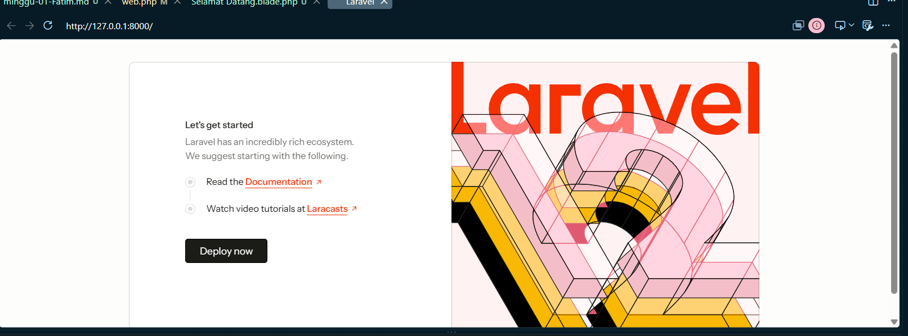
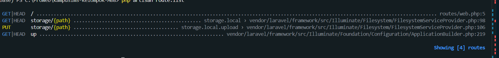
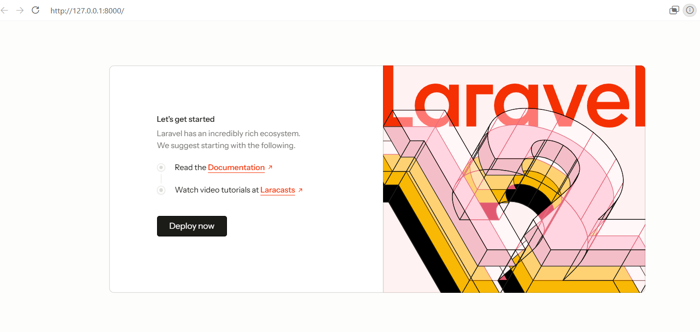
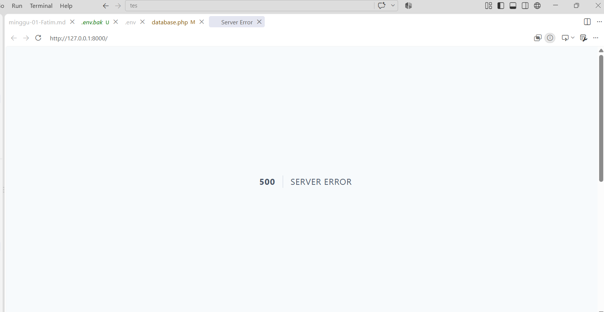
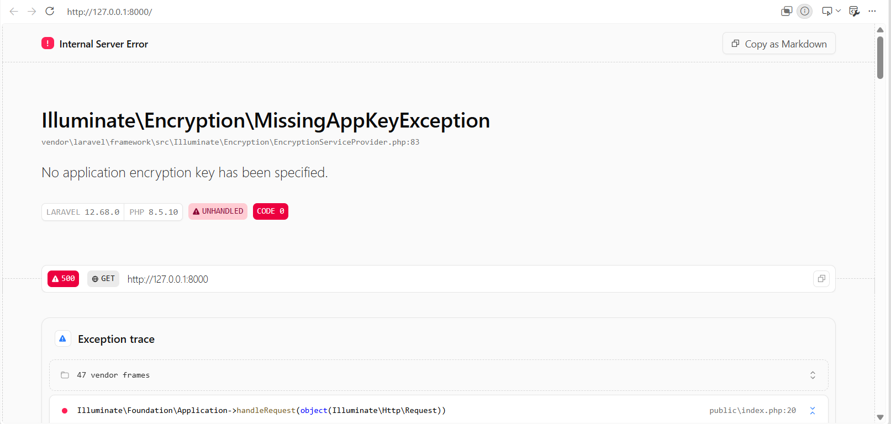
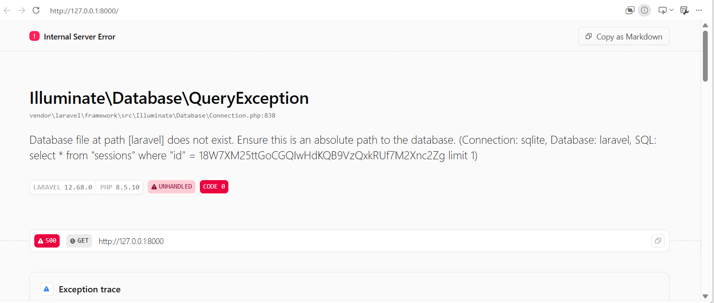
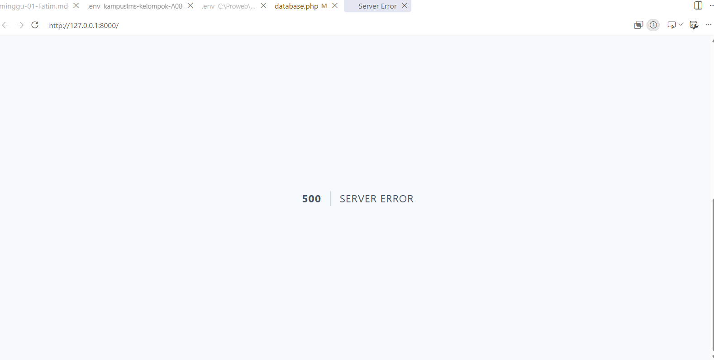

# READ 
## 1. Buka 'public/index.php' . Baca dari atas ke bawah. Tulis dalam 3 kalimat apa yang dilakukan berkas ini.

### Jawaban

`public/index.php` menjadi pintu masuk pada Laravel. Jadi saat browser mengirim request, file ini menyiapkan Laravel dengan mengecek maintenance mode, memuat Composer, dan memuat aplikasi dari bootstrap/app.php. Setelah itu request dari browser ditangkap dan diberikan kepada aplikasi Laravel untuk diproses sampai menghasilkan response.

## 2. Buka bootstrap/app.php. Identifikasi bagian mana yang mengurus route, mana yang mengurus middleware, mana yang mengurus exception.

### Jawaban

1. Bagian yang Mengatur routing dan menentukan file route yaitu `withRouting()`
2. Bagian yang mengatur middleware yaitu `withMiddleware().`
3. Bagian yang mengatur penanganan error/exception yaitu `withExceptions().`

## 3. Buka routes/web.php. Temukan route yang menghasilkan halaman selamat datang. Ubah teksnya, muat ulang browser, pastikan berubah.

### Jawaban
Pada percobaan ini, teks **“Welcome”** pada route diubah menjadi **“Selamat Datang”**. Setelah dijalankan, muncul error karena pada bagian route Laravel mencari view dengan nama **“Selamat Datang”**, sedangkan view tersebut belum tersedia dan masih menggunakan nama **“Welcome”**. 
### Perubahan

### Hasil Menjalankan di Server

Kemudian, nama view yang sebelumnya **“Welcome”** diubah menjadi **“Selamat Datang”** agar sesuai dengan yang dipanggil oleh route. Setelah perubahan tersebut dilakukan, program dijalankan kembali melalui  Laravel berhasil menampilkan halaman **“Selamat Datang”** dengan baik

karena funsi Route sebagai pengatur jalur atau tujuan request, yaitu menentukan halaman atau view mana yang harus ditampilkan ketika pengguna mengakses alamat tertentu.

### 4. Jalankan php artisan route:list. Cocokkan keluarannya dengan isi routes/web.php

### Jawaban
Pada hasil tersebut terdapat 4 route, tetapi yang berasal dari kode routes/web.php adalah route GET|HEAD /, yang ditunjukkan oleh tulisan routes/web.php:5. Ini sesuai dengan isi routes/web.php, yaitu Route::get('/', function () { return view('Selamat Datang'); });. Artinya, ketika pengguna membuka halaman utama aplikasi pada alamat /, Laravel menjalankan route tersebut dan kemudian memanggil view('Selamat Datang') untuk menampilkan halaman yang sesuai.

# BREAK
 
## 1. Ganti nama .env menjadi .env.bak	

### Jawaban
Ketika file `.env` diubah namanya menjadi `.env.bak`, Laravel tidak lagi menemukan file `.env` pada direktori utama project. karena File `.env` digunakan Laravel untuk menyimpan konfigurasi environment seperti `APP_KEY`, konfigurasi database, dan pengaturan aplikasi lainnya. Jadi saat aplikasi dijalankan tanpa file `.env`, Laravel tidak dapat membaca konfigurasi yang sebelumnya didefinisikan di dalam file tersebut. Akibatnya, Laravel akan menggunakan nilai default yang tersedia pada konfigurasi aplikasi atau dapat menghasilkan error apabila terdapat konfigurasi penting yang tidak memiliki nilai default.

### Sebelum

### Sesudah

## 2. Kosongkan nilai APP_KEY di .env		

### Jawaban
`APP_KEY` di dalam file `.env` merupakan application key yang digunakan Laravel untuk berbagai proses enkripsi. Ketika nilainya kosong, Laravel tidak memiliki kunci aplikasi untuk melakukan proses enkripsi yang membutuhkan `APP_KEY`.

Sehingga ketika menjalankan aplikasi atau perintah Laravel yang membutuhkan application key, yang muncul adalah pesan error yang menunjukkan bahwa application key belum ditentukan.

### Hasil

## 3. Ubah DB_DATABASE menjadi nama yang tidak ada

### Jawaban

Disini nilai DB_DATABASE diubah menjadi nama database yang tidak tersedia. Setelah aplikasi dijalankan kembali, Laravel mencoba mengakses database sesuai dengan konfigurasi tersebut.karena database yang dikonfigurasi tidak ditemukan, Laravel mengalami 500 Internal Server Error saat menjalankan query ke database. Berdasarkan hasil pengujian, muncul pesan Illuminate\Database\QueryException dengan keterangan Database file at path [laravel] does not exist, yang menunjukkan bahwa file database SQLite dengan nama laravel tidak ditemukan.

Error terjadi ketika Laravel mencoba menjalankan query select * from "sessions", sehingga proses tersebut gagal. Karena APP_DEBUG=true, Laravel menampilkan informasi error secara lengkap, seperti jenis exception, lokasi file yang mengalami error, koneksi yang digunakan yaitu SQLite, nama database, serta query yang gagal. Hasil yang diamati adalah aplikasi tidak dapat dijalankan secara normal dan menampilkan halaman 500 dengan detail penyebab error karena database yang dikonfigurasi tidak ditemukan.

### Hasil

## 4. Ubah APP_DEBUG=false, lalu ulangi nomor 3 Nomor 4 adalah yang terpenting.   

## Perhatikan bedanya: dengan APP_DEBUG=true Anda melihat seluruh isi konfigurasi dan jejak kode; dengan false Anda hanya melihat halaman 500 kosong. Di server produksi nanti, APP_DEBUG=true berarti membocorkan kredensial database Anda kepada siapa pun yang memicu error. Ini akan diuji di minggu 12.

### Jawaban

Aplikasi tetap mengalami error karena database yang dikonfigurasi tidak ditemukan, tetapi perbedaannya terletak pada informasi yang ditampilkan kepada pengguna. Ketika APP_DEBUG=false, Laravel tidak lagi menampilkan detail error seperti jenis exception, lokasi file, baris kode, query yang gagal, maupun informasi konfigurasi database. 

Pengguna hanya akan melihat halaman 500 | Server Error atau pesan error umum. Hal ini menunjukkan bahwa APP_DEBUG tidak menghilangkan error, tetapi hanya menyembunyikan informasi teknis mengenai error tersebut. Dari percobaan ini dapat disimpulkan bahwa penggunaan APP_DEBUG=true cocok saat proses pengembangan karena membantu developer mengetahui penyebab kesalahan, sedangkan pada server produksi sebaiknya menggunakan APP_DEBUG=false untuk mencegah informasi internal aplikasi dan konfigurasi database terekspos kepada pengguna.

### Hasil
