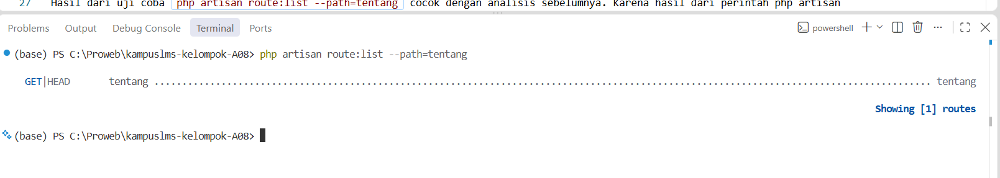
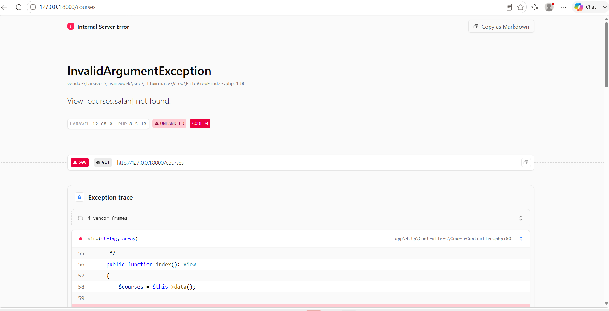
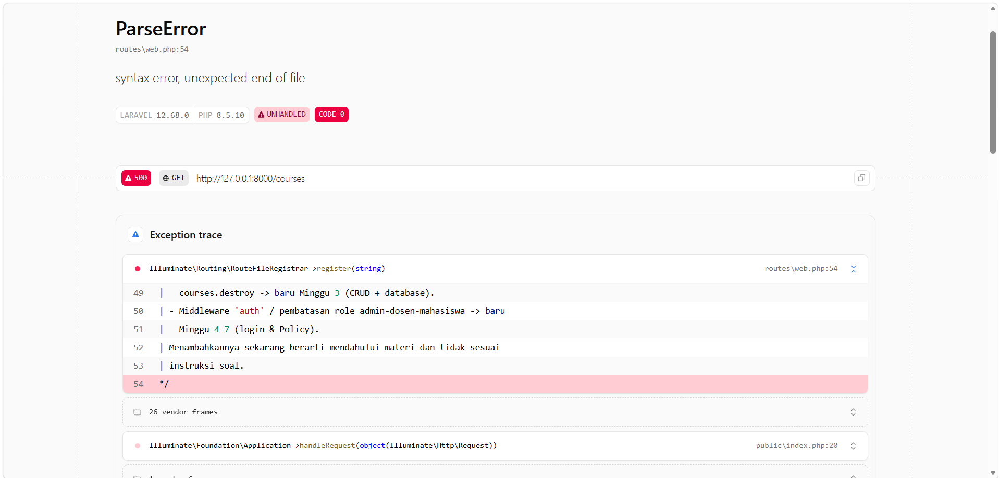
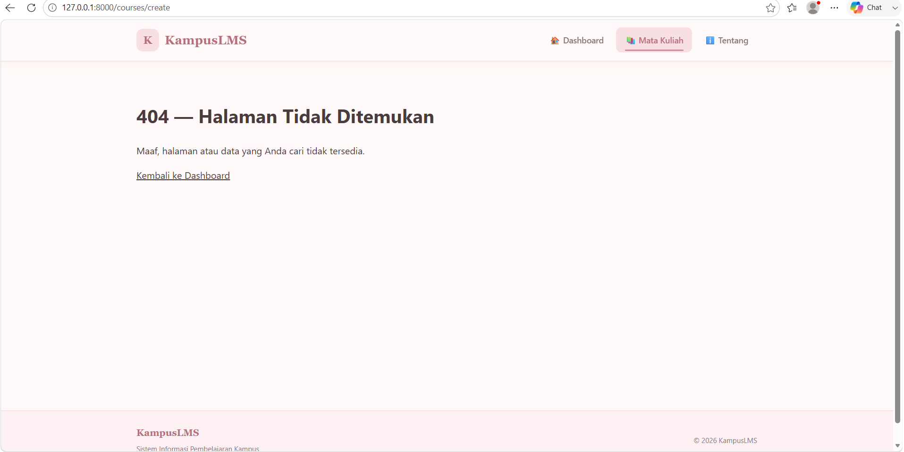
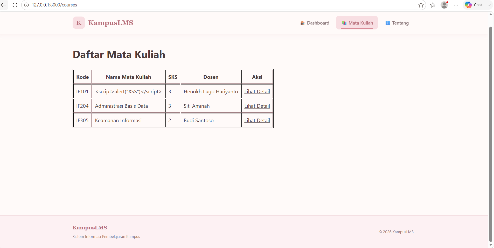
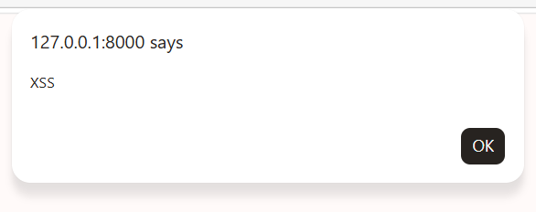
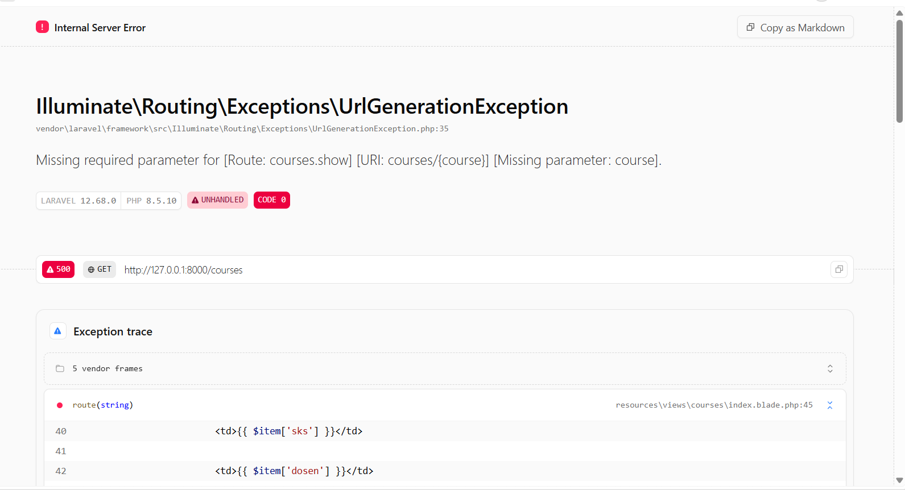

# READ  

## 1.Baris mana di routes/web.php yang menangkapnya?

### Jawaban:
Baris yang menangkap routes/web.php untuk route/tentang adalah berikut `Route::view('/tentang', 'tentang')->name('tentang')`.Karena ketika pengguna membuka alamat/tentang, Laravel akan langsung menampilkan halaman tentang.

## 2.Kalau ditangani controller, berkas dan method mana?

### Jawaban:
Jika ditangani di controller berada di berkas `app/Http/Controllers/CourseController.php` dan ditangani oleh method `index()`yang bertugas mengambil data mata kuliah kemudian mengirimkannya ke halaman View.

## 3.View mana yang dikembalikan? Di path apa persisnya?

### Jawaban:
View yang di kembalikan adalah `courses.index.` dengan path sebagai berikut `resources/views/courses/index.blade.php`. Sehingga dari nama tersebut, Laravel mencari file index.blade.php di dalam folder courses.

## 4. Layout apa yang membungkusnya?

### Jawaban:
Layout yang digunakan adalah x-layout, yaitu layout komponen Blade yang membungkus isi halaman courses.index. Layout ini berfungsi sebagai pembungkus halaman sehingga bagian-bagian umum tampilan dapat digunakan kembali tanpa harus ditulis ulang di setiap halaman.

## 5. Jalankan php artisan route:list --path=tentang. Cocok dengan analisis Anda?
### Jawaban:
Hasil dari uji coba `php artisan route:list --path=tentang` cocok dengan analisis sebelumnya. Karena hasil dari perintah `php artisan route:list --path=tentang` menunjukkan bahwa route /tentang memang terdaftar di Laravel dengan metode `GET|HEAD` dan memiliki nama route tentang. Sehingga ini sesuai dengan kode di routes/web.php, yaitu `Route::view('/tentang', 'tentang')->name('tentang')`;.  Jadi, dapat disimpulkan bahwa route /tentang sudah dibuat dan dikenali dengan benar oleh Laravel.

### Hasil Uji Coba

 

# BREAK  

## 1.Ubah Route::get menjadi Route::post pada route daftar mata kuliah	Method HTTP tidak cocok → 405

### Jawaban:
Setelah method pada route daftar mata kuliah diubah dari `GET` menjadi `POST`, ketika halaman /courses diakses melalui browser, muncul error 405 Method Not Allowed. Hal ini terjadi karena browser mengirimkan request menggunakan method `GET`, sedangkan route /courses hanya menerima method POST. Error tersebut menunjukkan bahwa method HTTP yang digunakan tidak sesuai dengan method yang didukung oleh route.

## 2.Ubah nama view di return view(...) menjadi yang tidak ada	Exception view not found

### Jawaban:
Setelah nama view pada return view() diubah dari `courses.index` menjadi `courses.salah`, kemudian halaman /courses diakses, Laravel menampilkan `InvalidArgumentException: View [courses.salah] not found`. Error tersebut terjadi karena Laravel mencoba mencari view courses.salah, tetapi file resources/views/courses/salah.blade.php tidak tersedia. Hal ini menunjukkan bahwa nama view yang dipanggil pada controller harus sesuai dengan file Blade yang tersedia.

## 3.Hapus ->name('courses.show'), lalu muat halaman yang memakai route('courses.show')	Kenapa nama route wajib

### Jawaban: 
Hasil error menunjukkan bahwa terdapat kesalahan sintaks pada file routes/web.php. Laravel tidak dapat membaca file tersebut sampai selesai karena terdapat bagian kode yang belum ditutup atau tanda sintaks yang kurang. Error ditunjukkan pada routes/web.php:54, yaitu pada bagian akhir file. Karena file route tidak dapat diproses, Laravel tidak dapat menjalankan route /courses dan menampilkan error 500.

Kode mencari route berdasarkan nama courses.show, bukan berdasarkan URL secara langsung. Jadi Ketika `->name('courses.show')` dihapus dari web.php, Laravel tidak menemukan route dengan nama tersebut sehingga muncul error:`Route [courses.show] not defined.`

Jadi, nama route berfungsi sebagai identitas/panggilan untuk sebuah route. Dengan adanya nama `courses.show`, Laravel dapat membuat URL menuju halaman detail mata kuliah tanpa harus menuliskan URL secara langsung.

## 4.Pindahkan /courses/{course} ke ATAS /courses/create, lalu buka /courses/create	Urutan route menentukan

### Jawaban:
Hasil percobaan menunjukkan bahwa saat membuka /courses/create, muncul halaman 404 (Halaman Tidak Ditemukan). Ini terjadi karena Laravel membaca create sebagai nilai `{course}`, bukan sebagai halaman create. Hal tersebut terjadi karena route /`courses/{course}` diletakkan lebih dulu. Jadi, percobaan ini membuktikan bahwa urutan route penting karena Laravel akan membaca route yang berada di atas terlebih dahulu.

## 5.Ganti {{ $nama }} menjadi {!! $nama !!}, isi $nama dengan 	XSS nyata di layar Anda sendiri

### Jawaban:
Percobaan ini menunjukkan bahwa `{{ $course['nama'] }}` dan `{!! $course['nama'] !!}` memiliki fungsi yang berbeda dalam menampilkan data. {{ }} digunakan untuk menampilkan data dengan aman karena Laravel akan menganggap kode HTML atau JavaScript sebagai teks, sehingga `` hanya terlihat sebagai tulisan dan tidak dijalankan. Sedangkan `{!! !!}` digunakan untuk menampilkan isi data sebagai HTML tanpa proses pengamanan (escaping), sehingga ketika data nama mata kuliah berisi ``, browser menganggapnya sebagai kode JavaScript dan menjalankannya, sehingga muncul pop-up “XSS” seperti pada hasil percobaan. Percobaan ini bertujuan untuk menunjukkan bahwa {!! !!} dapat menyebabkan XSS jika digunakan pada data yang tidak terpercaya, sedangkan {{ }} lebih aman untuk menampilkan data biasa.

### Sebelum

### Setelah

### Output

 

## 6.Hapus @vite(...) dari layout	Aset tidak termuat

### Jawaban:
Percobaan penghapusan `@vite(...)` menunjukkan bahwa Vite berfungsi untuk memuat aset CSS dan JavaScript pada aplikasi Laravel. Namun, pada project ini tampilan tidak mengalami perubahan setelah `@vite(...)` dihapus karena sebagian besar CSS dan JavaScript masih ditulis langsung di dalam file layout. Oleh karena itu, aset utama tampilan tetap dapat dimuat meskipun `@vite(...)` dihilangkan. Percobaan ini menunjukkan bahwa efek penghapusan Vite akan terlihat apabila aset CSS dan JavaScript memang dikelola melalui Vite.

## 7.Hentikan npm run dev lalu muat ulang halaman	Beda dev server vs build

### Jawaban:
Setelah npm run dev dihentikan, tampilan website tidak berubah. Hal ini karena CSS dan JavaScript masih ada di dalam file layout. Kemudian saat menjalankan npm run build, proses berhasil dan membuat file CSS serta JavaScript untuk digunakan dalam mode production. Jadi, npm run dev digunakan saat membuat atau mengembangkan website, sedangkan npm run build digunakan untuk menyiapkan website agar bisa dijalankan tanpa development server.

## 8.Panggil route('courses.show') tanpa mengirim parameter	Missing required parameter
Nomor 5 wajib benar-benar dicoba, bukan dibayangkan. Melihat alert muncul dari data yang Anda "masukkan sebagai pengguna" mengubah cara Anda memandang setiap keluaran di layar selamanya.

### Jawaban:
Percobaan menunjukkan bahwa ketika `route('courses.show')` dipanggil tanpa memberikan parameter, Laravel menampilkan error Missing required parameter. Error tersebut terjadi karena route `courses.show` memiliki parameter `{course}` yang wajib diisi agar Laravel mengetahui mata kuliah mana yang ingin ditampilkan. Pada percobaan ini, parameter ID mata kuliah sengaja dihilangkan sehingga halaman tidak dapat dibuka dan muncul error. Dari percobaan tersebut dapat diketahui bahwa parameter pada route harus diberikan jika parameter tersebut bersifat wajib, misalnya dengan menggunakan `route('courses.show', $item['id'])`.
