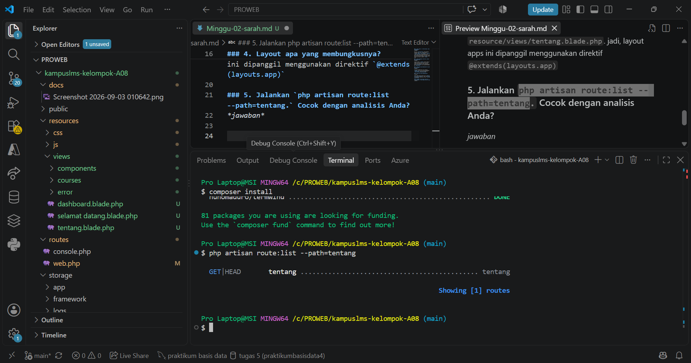
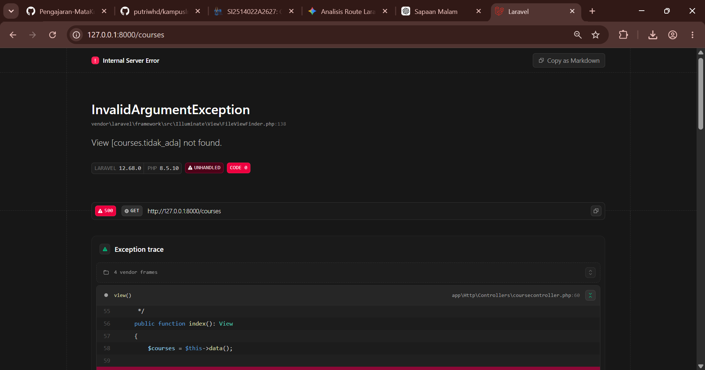
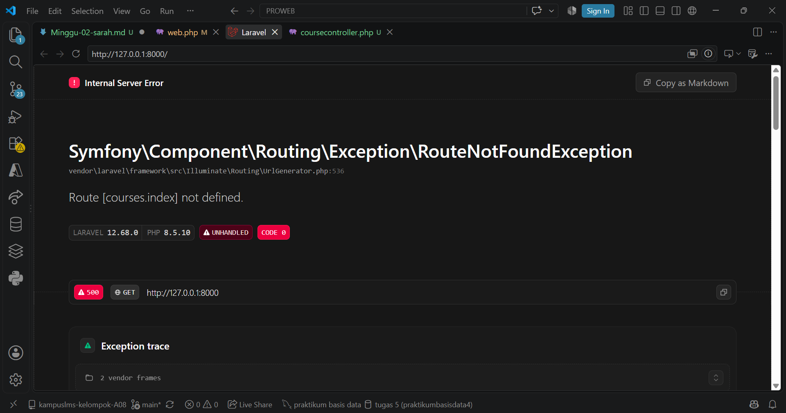
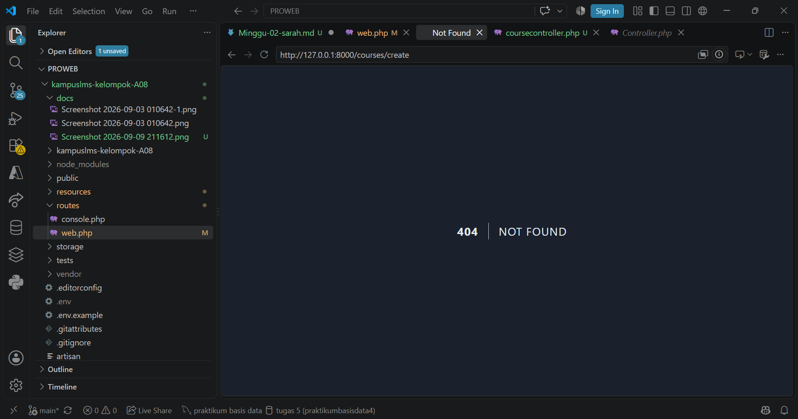
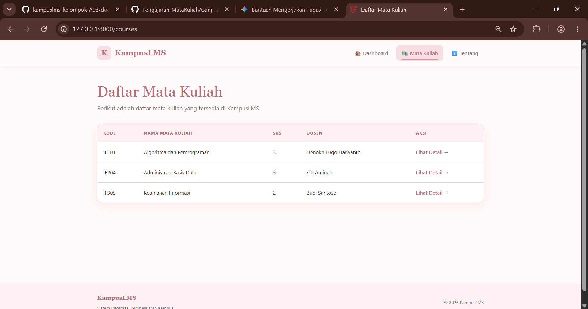
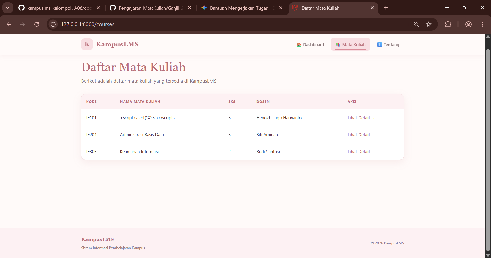

# READ

### 1. Baris mana di `routes/web.php` yang menangkapnya?
*jawaban*

Baris di `routes/web.php` yang menangkap terdapat pada line 7, dimana dibaris tersebut `Route::view('/tentang', 'tentang')->name('tentang');` dikarenakan disini laravel akan langsung meneruskannya ke view yang langsung akan kembali ke browser tidak perlu ke controller ataupun ke model karena request nya hanya ke bagian `tentang` saja . 

### 2. Kalau ditangani controller, berkas dan method mana?
*jawaban*

untuk di bagian `/tentang` karena tidak di tangani oleh controller dan dia bersifat statis atau berupa teks biasa jadi dia langsung menampilkan ke view. mangkanya di kode `routes/web.php` dia langsung melempar ke `route::view` 

### 3. View mana yang dikembalikan? di path apa persisnya?
*jawaban*

view yang dikembalikan yaitu dibagian `tentang`, jadi di sini dia akan memanggil `view:tentang`. dan akan tersimpan di `resource/views/tentang.blade.php`

### 4. Layout apa yang membungkusnya?
*jawaban*

untuk layout nya dia ada di file `resource/views/tentang.blade.php`. jadi, layout apps ini dipanggil menggunakan direktif `@extends(layouts.app)`

### 5. Jalankan `php artisan route:list --path=tentang.` Cocok dengan analisis Anda?
*jawaban*

dari hasil `jalankan php artisan route:list --path=tentang` terlihat bahwa laravel berhasil menjalankan program dengan benar, terbukti dengan tampilnya route `GET` dan `head` `tentang` yang berarti route telah terdaftar dan siap menjalankan request ke `URL/Tentang`.

# BREAK

### 1. Ubah `Route::get` menjadi `Route::post` pada route daftar mata kuliah

pada saat `Route::get menjadi Route::post` maka akan error 405 karena method tidak dapat menjalankan perintah tersebut. 

### 2. Ubah nama view di `return view(...) `menjadi yang tidak ada.
*jawaban*

pada saat di `app/Http/controllers/coursecontroller.php` di rubah pada line `view` menjadi `courses.tidak_ada` maka akan terjadi error karena pada saat diakses berkas tidak ditemukan sehingga sistem menampilkan error dengan pesan `view [courses.tidak_ada] not found`. 

### 3. Hapus `->name('courses.show')`, lalu muat halaman yang memakai `route('courses.show')`.
*jawaban*

 

pada saat `>name('courses.show')` dihapus maka ketika blade.php memanggil URL maka akan terjadi `UrlGenerator` melempar exception RouteNotFoundException yang menghasilkan HTTP Status 500 (Internal Server Error) dengan pesan Route `not defined` karena rute dengan nama tersebut tidak terdaftar.

### 4. Pindahkan `/courses/{course} ke ATAS /courses/create`, lalu buka `/courses/create`.
*jawaban*

Laravel membaca rute dari atas ke bawah. Saat rute `/courses/{course}` ditaruh di atas `/courses/create`, Laravel menganggap kata `'create'` sebagai parameter {course} (ID/slug). Laravel lalu mencari data course bernama 'create' di database, dan karena datanya tidak ada, maka muncul error 404

### 5. Ganti `{{ $nama }}` menjadi `{!! $nama !!}`, isi $nama dengan ``
*jawaban*

## Sebelum

## Sesudah

## Output 

.png>)

Percobaan ini menunjukkan bahwa {{ $course['nama'] }} dan {!! $course['nama'] !!} memiliki fungsi yang berbeda dalam menampilkan data. {{ }} digunakan untuk menampilkan data dengan aman karena Laravel akan menganggap kode HTML atau JavaScript sebagai teks, sehingga  hanya terlihat sebagai tulisan dan tidak dijalankan. Sedangkan {!! !!} digunakan untuk menampilkan isi data sebagai HTML tanpa proses pengamanan (escaping), sehingga ketika data nama mata kuliah berisi , browser menganggapnya sebagai kode JavaScript dan menjalankannya, sehingga muncul pop-up “XSS” seperti pada hasil percobaan. Percobaan ini bertujuan untuk menunjukkan bahwa {!! !!} dapat menyebabkan XSS jika digunakan pada data yang tidak terpercaya, sedangkan {{ }} lebih aman untuk menampilkan data biasa.

### 6. Hapus @vite(...) dari layout Aset tidak termuat.
*jawaban* 

Penghapusan `@vite(...)` membuktikan peran Vite dalam mengelola dan memuat aset CSS maupun JavaScript di Laravel. Pada proyek ini, tampilan tidak rusak saat `@vite(...)` dihapus karena kode CSS dan JavaScript masih tertulis secara internal di file layout. Alhasil, komponen utama antarmuka tetap berjalan normal. Hal ini menegaskan bahwa dampak hilangnya `@vite(...)` baru akan terlihat jika aset gaya dan skrip memang bergantung sepenuhnya pada pemrosesan Vite.

### 7. Hentikan npm run dev lalu muat ulang halaman.
*jawaban*

Menghentikan perintah npm run dev tidak memengaruhi tampilan halaman web saat dimuat ulang. Hal ini terjadi karena aset CSS dan JavaScript pada proyek ini dipanggil secara langsung (misalnya skrip internal di layout) dan tidak menggantungkan proses kompilasi secara real-time pada server pengembangan Vite.

### 8. Panggil route('courses.show') tanpa mengirim parameter.
*jawaban*

.png>)

Percobaan ini menunjukkan bahwa pemanggilan named `route courses.show` membutuhkan parameter wajib berupa nilai ID atau slug. Pada file `routes/web`.php, rute tersebut didefinisikan dengan skema URI `courses/{course}`, di mana {course} merupakan variabel wildcard yang bertindak sebagai identitas data yang ingin diakses. Ketika pembantu route`('courses.show')` dipanggil tanpa menyertakan argumen parameter di file Blade, sistem Laravel gagal membangkitkan URL yang valid karena kehilangan informasi variabel tersebut. Akibatnya, Laravel menghentikan eksekusi program dan melempar exception berupa `UrlGenerationException` dengan pesan Missing required parameter. Untuk menghindari error ini, pemanggilan named route yang memiliki wildcard harus selalu dibertandakan dengan data pendukung, seperti route`('courses.show', $item['id'])`.
