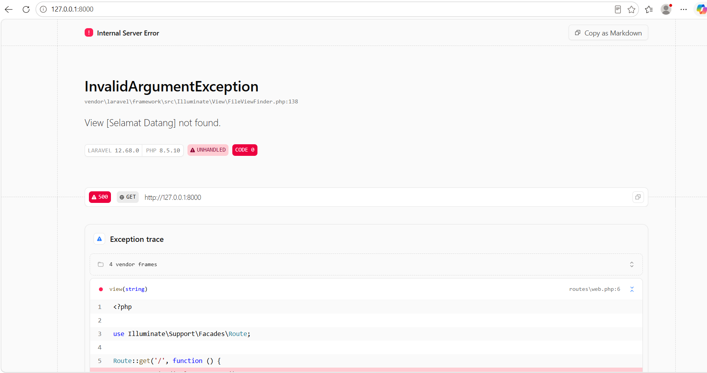
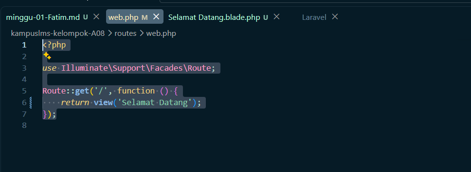

## 1. Buka 'public/index.php' . Baca dari atas ke bawah. Tulis dalam 3 kalimat apa yang dilakukan berkas ini.

### Jawaban

`public/index.php` menjadi pintu masuk pada Laravel. Jadi saat browser mengirim request, file ini menyiapkan Laravel dengan mengecek maintenance mode, memuat Composer, dan memuat aplikasi dari bootstrap/app.php. Setelah itu request dari browser ditangkap dan diberikan kepada aplikasi Laravel untuk diproses sampai menghasilkan response.

## 2. Buka bootstrap/app.php. Identifikasi bagian mana yang mengurus route, mana yang mengurus middleware, mana yang mengurus exception.

### Jawaban

1. Bagian yang Mengatur routing dan menentukan file route yaitu `withRouting()`
2. Bagian yang mengatur middleware yaitu `withMiddleware().`
3. Bagian yang mengatur penanganan error/exception yaitu `withExceptions().`

## 3. Buka routes/web.php. Temukan route yang menghasilkan halaman selamat datang. Ubah teksnya, muat ulang browser, pastikan berubah.

### Jawaban
Pada percobaan ini, teks **“Welcome”** pada route diubah menjadi **“Selamat Datang”**. Setelah dijalankan, muncul error karena pada bagian route Laravel mencari view dengan nama **“Selamat Datang”**, sedangkan view tersebut belum tersedia dan masih menggunakan nama **“Welcome”**. 

Kemudian, nama view yang sebelumnya **“Welcome”** diubah menjadi **“Selamat Datang”** agar sesuai dengan yang dipanggil oleh route. Setelah perubahan tersebut dilakukan, program dijalankan kembali melalui XAMPP dan Laravel berhasil menampilkan halaman **“Selamat Datang”** dengan baik.

karena funsi Route sebagai pengatur jalur atau tujuan request, yaitu menentukan halaman atau view mana yang harus ditampilkan ketika pengguna mengakses alamat tertentu.

### 4. Jalankan php artisan route:list. Cocokkan keluarannya dengan isi routes/web.php

### Jawaban
Pada hasil tersebut terdapat 4 route, tetapi yang berasal dari kode routes/web.php adalah route GET|HEAD /, yang ditunjukkan oleh tulisan routes/web.php:5. Ini sesuai dengan isi routes/web.php, yaitu Route::get('/', function () { return view('Selamat Datang'); });. Artinya, ketika pengguna membuka halaman utama aplikasi pada alamat /, Laravel menjalankan route tersebut dan kemudian memanggil view('Selamat Datang') untuk menampilkan halaman yang sesuai.

