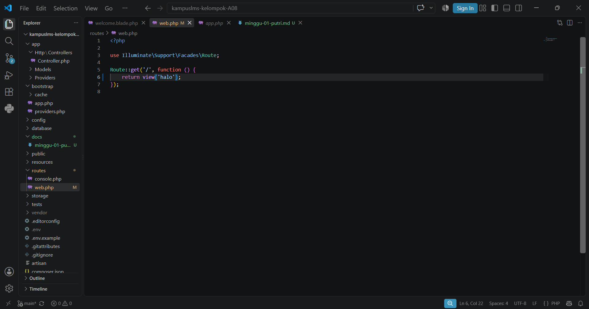
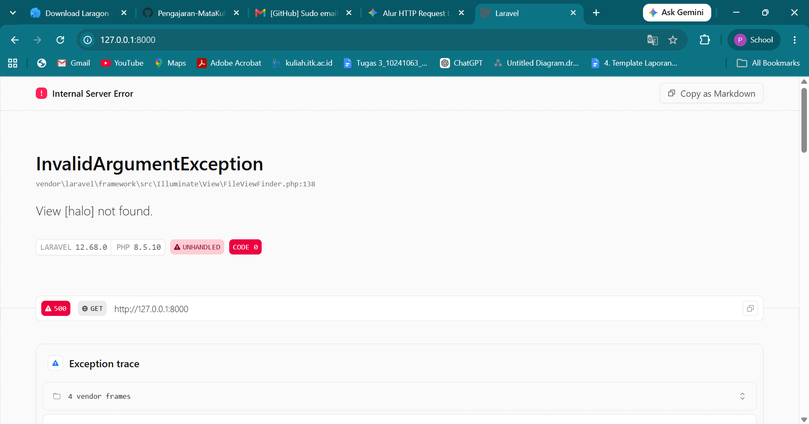
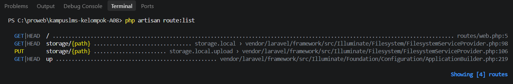

### 1. Buka 'public/index.php' . Baca dari atas ke bawah. Tulis dalam 3 kalimat apa yang dilakukan berkas ini.
Jawaban : 
Berkas ini berfungsi sebagai gerbang utama dalam seluruh HTTP request yang masuk ke dalam aplikasi laravel. berkas ini juga bertugas sebagai pendeteksi  mode pemeliharaan, memuat *autoloader* yang dihasilkan oleh composer dan memanggil aplikasi dari `bootsrap/app/php`. Berkas ini menganani request yang masuk dan mengirimkan response kembali ke browser pengguna. 

### 2. Buka bootstrap/app.php. Identifikasi bagian mana yang mengurus route, mana yang mengurus middleware, mana yang mengurus exception.
Jawaban : 
- bagian yang mengurus route : Dibagian `withRouting()`yang menentukan lokasi berkas rute utama 
- bagian mengurus middleware : Dibagian `withMiddleware()`tempat pendaftaran *middleware* kustom maupun pengaturan *middleware* global
- bagian `withExceptions()`, tempat untuk menangani error dan pelaporan *exception*

### 3. Buka routes/web.php. Temukan route yang menghasilkan halaman selamat datang. Ubah teksnya, muat ulang browser, pastikan berubah.
Jawaban : 
 ketika mengubah teks nya menjadi 'halo' halaman browser menjadi error karena pada routes/web.php bertugas untuk mencari pada resource/welcome.blade.php dan file welcome.blade.php nya tidak diubah menjadi 'halo'

### 4. Jalankan php artisan route:list. Cocokkan keluarannya dengan isi routes/web.php
Jawaban : 

