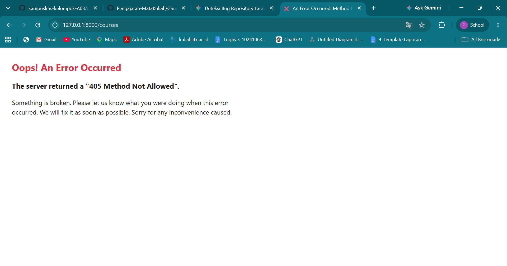
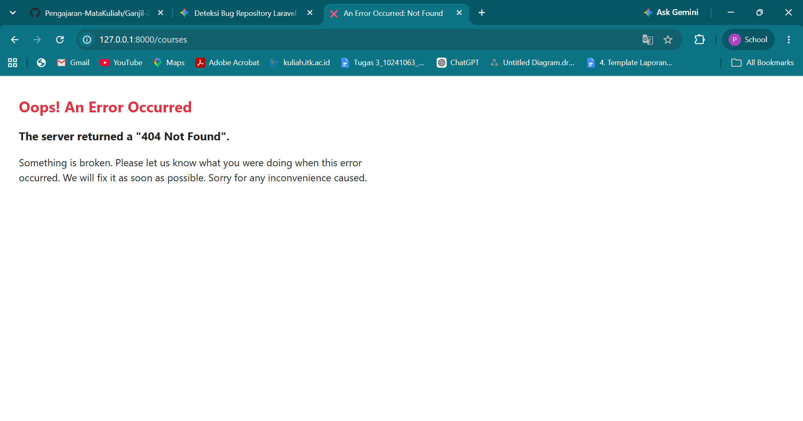

## READ

1. Baris mana di routes/web.php yang menangkapnya?

    Jawaban : Baris yang menangkap `/tentang` pada `routes/web.php` pada baris `Route::view('/tentang', 'tentang')->name('tentang');` 

2. Kalau ditangani controller, berkas dan method mana?

    Jawaban : `/tentang` tidak ditangani oleh controller melainkan diproses secara langsung melalui closure atau penanganan view secara langsung pada rute

3. View mana yang dikembalikan? Di path apa persisnya?
    Jawaban : Berkas view yang dikembalikan adalah `tentang.blade.php` yang berada di dalam `resources/views/tentang.blade.php` 

4. Layout apa yang membungkusnya?
    
    Jawaban : Layout yang membungkusanya adalah `<x-layout>` yang terletak pada berkas `resources/views/components/.layout.blade.php` 

5. Jalankan `php artisan route:list --path=tentang`. Cocok dengan analisis Anda?

    Jawaban : 
Iya, rute `/tentang` dibuat menggunakan Route::view, rute ini menggunakan methode GET dan langsung mengarahkan pengguna ke view `tentang` tanpa controller. Perintah `php artisan route:list --path=tentang`menampilkan `GET` pada `tentang` yang mengarahkan ke aksi `tentang`

## BREAK
1. Ubah Route::get menjadi Route::post pada route daftar mata kuliah

    Jawaban : Ketika Route::get diubah menjadi Route::post pada route daftar mata kuliah, muncul error 405 Method Not Allowed. Hal ini terjadi karena saat URL diakses lewat browser, browser secara otomatis mengirimkan permintaan bertipe GET (hanya ingin mengambil/melihat data). Sedangkan server diatur hanya menerima permintaan bertipe POST (mengirim data), sehingga akses ditolak oleh sistem routing Laravel.

    "

2. Ubah nama view di return view(...) menjadi yang tidak ada

    Jawaban : Ketika nama view diubah menjadi  return view `('courses.putri',... )` pada `CourseController.php` menampilkan error InvalidArgumentException (View [courses.putri] not found). karena controller meminta laravel memanggil file tampilan `putri.blade.php` di dalam folder resources/views/courses/ karena berkas tersebut tidak ada di dalam proyek maka terjadi error

    

3. Hapus ->name('courses.show'), lalu muat halaman yang memakai route('courses.show')

    jawaban : Ketika `->name('courses.show')` dihapus dari file `routes/web.php`, muncul error RouteNotFoundException (Route [courses.show] not defined). Hal ini terjadi karena file View memanggil fungsi `route('courses.show')` untuk membuat link detail, tetapi nama route tersebut tidak terdaftar di sistem routing Laravel.
    

4. Pindahkan /courses/{course} ke ATAS /courses/create, lalu buka /courses/create

    jawaban : 
    Ketika route `/courses/{course}` diletakkan di atas `/courses/create`, pengaksesan URL /courses/create akan menghasilkan error 404 Not Found (NotFoundHttpException). Hal ini terjadi karena Laravel membaca route dari atas ke bawah, sehingga menganggap kata "create" sebagai isi variabel {course} dan mengarahkannya ke method show(), bukan ke method create()
    

5. Ganti {{ $nama }} menjadi {!! $nama !!}, isi $nama dengan 

    Jawaban : Mengubah sintaks Blade dari `{{ $item['nama'] }}` menjadi `{!! $item['nama'] !!}` membuat data ditampilkan secara unescaped tanpa melalui fungsi htmlspecialchars(). Ketika string disisipi kode ``, browser langsung mengeksekusi script tersebut dan menampilkan pop-up alert. Hal ini membuktikan bahwa penggunaan `{!! !!}` yang tidak hati-hati dapat memicu celah keamanan Cross-Site Scripting (XSS).
    
    

6. Hapus @vite(...) dari layout

    Jawaban : Percobaan penghapusan `@vite(...)` membuktikan bahwa fitur tersebut digunakan untuk mengelola serta memuat aset CSS dan JavaScript pada aplikasi Laravel. Walaupun demikian, tampilan proyek ini tidak mengalami perubahan setelah `@vite(...)` dihapus karena aset CSS dan JavaScript masih ditulis langsung (inline) di dalam berkas layout. Alhasil, elemen utama antarmuka tetap berjalan normal. Eksperimen ini memperjelas bahwa dampak dari hilangnya `@vite(...)` baru akan terlihat jika aset CSS dan JavaScript sepenuhnya dikelola lewat bundler Vite.

7. Hentikan npm run dev lalu muat ulang halaman Beda dev server vs build
   
    Jawaban : Tampilan situs web tidak berubah meski `npm run dev` dihentikan karena berkas CSS dan JavaScript ditulis langsung di dalam berkas layout. Sementara itu, perintah `npm run build` berhasil mengeksekusi kompilasi dan menghasilkan berkas CSS serta JavaScript siap pakai untuk lingkungan production. Dari proses ini dapat disimpulkan bahwa npm run dev berfungsi mendampingi proses pengembangan aplikasi (development), sedangkan npm run build berguna menyiapkan aplikasi agar dapat berjalan optimal tanpa memerlukan server pengembang

8. Panggil route('courses.show') tanpa mengirim parameter Missing required parameter

    Jawaban : percobaan menunjukkan bahwa pemanggilan `route('courses.show')` tanpa argumen memicu error Missing required parameter. Kendala ini muncul karena `rute courses.show` membutuhkan parameter {course} agar sistem dapat mengidentifikasi data mata kuliah. Ketika parameter ID ini sengaja dikosongkan, halaman gagal diakses. Percobaan tersebut menegaskan pentingnya menyertakan argumen yang bersifat wajib saat memanggil rute, seperti penulisan route`('courses.show', $item['id'])`.