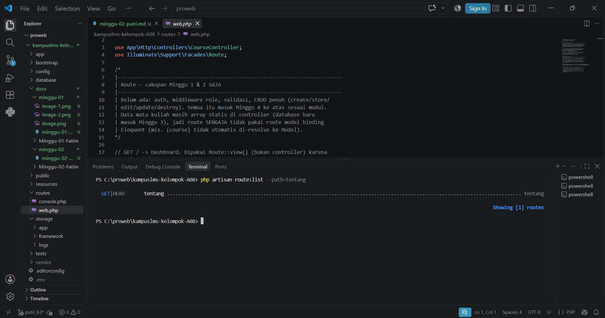

## 1. Baris mana di routes/web.php yang menangkapnya?
Jawaban : Baris yang menangkap `/tentang` pada `routes/web.php` pada baris `Route::view('/tentang', 'tentang')->name('tentang');` 

## 2. Kalau ditangani controller, berkas dan method mana?
Jawaban : `/tentang` tidak ditangani oleh controller melainkan diproses secara langsung melalui closure atau penanganan view secara langsung pada rute

## 3. View mana yang dikembalikan? Di path apa persisnya?
Jawaban : Berkas view yang dikembalikan adalah `tentang.blade.php` yang berada di dalam `resources/views/tentang.blade.php` 

## 4. Layout apa yang membungkusnya?
Jawaban : Layout yang membungkusanya adalah `<x-layout>` yang terletak pada berkas `resources/views/components/.layout.blade.php` 

## 5. Jalankan `php artisan route:list --path=tentang`. Cocok dengan analisis Anda?
Jawaban : 
Iya, rute `/tentang` dibuat menggunakan Route::view, rute ini menggunakan methode GET dan langsung mengarahkan pengguna ke view `tentang` tanpa controller. Perintah `php artisan route:list --path=tentang`menampilkan `GET` pada `tentang` yang mengarahkan ke aksi `tentang`