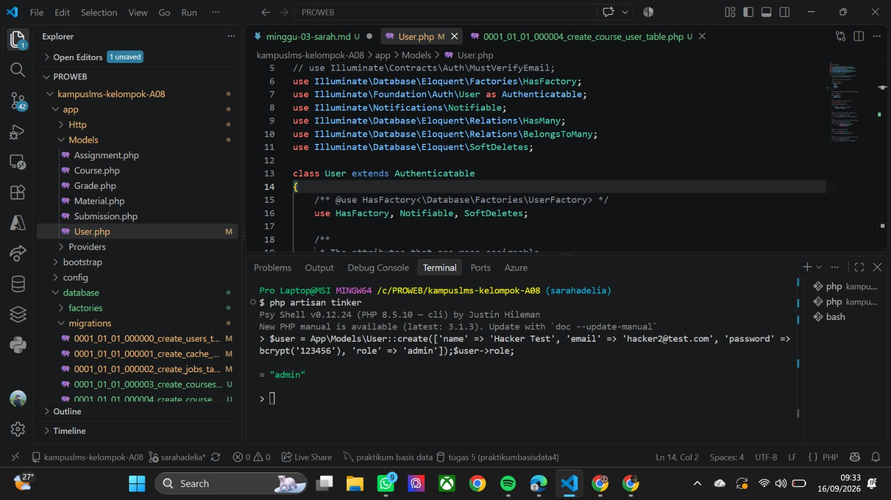
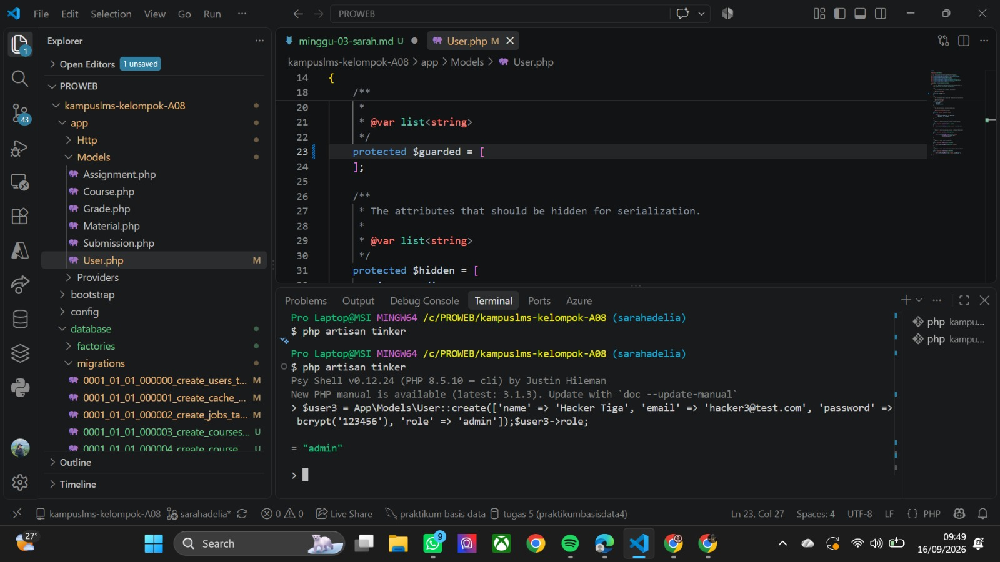
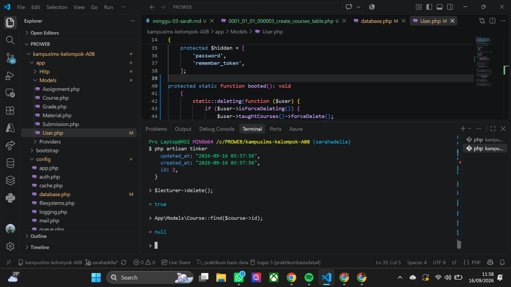

### Read

1. Gambar ulang ERD dari spesifikasi di papan/kertas, tanpa melihat dokumen.

    Jawaban : 

2. Untuk setiap foreign key, tentukan perilaku onDelete-nya dan tuliskan alasannya.

    Jawaban : 

- Foreign key lecturer_id pada tabel courses merujuk ke id di tabel users dengan aturan restrictOnDelete, agar data mata kuliah tidak ikut hilang saat data dosen dihapus.

- Foreign key course_id pada tabel course_user merujuk ke id di tabel courses menggunakan cascadeOnDelete, karena data kepesertaan mahasiswa tidak lagi dibutuhkan jika mata kuliahnya dihapus.

-  Foreign key user_id pada tabel course_user merujuk ke id di tabel users menggunakan cascadeOnDelete, sehingga data pendaftaran mata kuliah otomatis terhapus ketika akun pengguna dihapus.

- Foreign key course_id pada tabel materials merujuk ke id di tabel courses menggunakan cascadeOnDelete, sebab materi merupakan bagian dari mata kuliah yang akan ikut terhapus saat mata kuliahnya dihapus.

- Foreign key uploaded_by pada tabel materials merujuk ke id di tabel users menggunakan restrictOnDelete, agar berkas materi tetap tersimpan di sistem meski akun pengunggahnya dihapus.

- Foreign key course_id pada tabel assignments merujuk ke id di tabel courses menggunakan cascadeOnDelete, sebab tugas merupakan komponen mata kuliah yang akan ikut terhapus jika mata kuliahnya dihapus.

- Foreign key created_by pada tabel assignments merujuk ke id di tabel users menggunakan restrictOnDelete, agar data tugas tidak hilang meskipun akun pembuatnya dihapus.

- Foreign key assignment_id pada tabel submissions merujuk ke id di tabel assignments menggunakan cascadeOnDelete, karena data pengumpulan bergantung pada tugas terkait dan akan terhapus jika tugasnya dihapus.

- Foreign key user_id pada tabel submissions merujuk ke id di tabel users menggunakan restrictOnDelete, sebab data pengumpulan tugas merupakan rekam akademik yang wajib dipertahankan meski akun pengguna dihapus.

- Foreign key submission_id pada tabel grades merujuk ke id di tabel submissions menggunakan cascadeOnDelete, karena data nilai terikat pada pengumpulan tugas dan akan terhapus jika data pengumpulannya dihapus.

- Foreign key graded_by pada tabel grades merujuk ke id di tabel users menggunakan restrictOnDelete, agar riwayat nilai tetap tersimpan di sistem meskipun akun penilainya dihapus.

3. kalau seorang dosen dihapus, apa yang terjadi pada mata kuliahnya? Kenapa dirancang begitu?

    Jawaban : 

    Jika seorang dosen dihapus dari sistem, mata kuliahnya tidak akan ikut tehapus karena `lecturer_id` menggunakan resticondelete sehingga jika dosen yang masih memiliki mata kuliah tidak dapat langsung di hapus. Hal ini dirancamg agar mata kuliah dan data dalam sistem akan aman dan tidak ikut terhapus

4. kenapa grades.submission_id bersifat unique, bukan sekadar index biasa?

    Jawaban : Karena satu submisson hanya boleh dimiliki satu nilai. Dengan unique, database dapat mencegah satu submission memiliki lebih dari satu nilai, sedangkan index hanya digunakan untuk mempercepat pencairan data dan tidak mencegah data yang sama dibuat lebih dari sekali. Jadi, unique digunakan hanya untuk memastikan hubungan antara submission dan grade tetap satu submission memiliki maksimal satu grade.

### Break 

1. Hapus unique(['course_id','user_id']) dari course_user, lalu daftarkan mahasiswa yang sama dua kali
    
    jawaban : 

    

Data ganda lolos tanpa keluhan karena di line unique(['course_id','user_id']) di hapus dan akhirnya sistem menjalankan dengan baik karena database tidak lagi memvalidasi keunikan kombinasi.

2. Tambahkan role ke $fillable model User, lalu kirim request pembuatan user dengan role=admin lewat form yang tidak punya field role

    jawaban:

    

Ketika 'role' dimasukkan ke dalam $fillable, terjadi celah keamanan (Mass Assignment). Pengguna biasa bisa secara diam-diam menyelipkan data role=admin saat mendaftar. Karena 'role' terdaftar di $fillable, Laravel mengira input itu memang diizinkan, sehingga pengguna biasa tersebut bisa langsung berubah jadi Admin.

3. Ganti seluruh $fillable dengan protected $guarded = []; lalu ulangi nomor 2

    jawaban :

    

Mengosongkan $guarded (protected $guarded = [];) sangat berbahaya karena mematikan seluruh proteksi mass assignment. Efeknya, semua kolom database tanpa terkecuali bisa diisi secara bebas dari input pengguna, sehingga role bisa langsung diubah jadi Admin saat pembuatan akun.

4. Kosongkan isi down() di satu migrasi, lalu jalankan php artisan migrate:refresh.

    jawaban :

Mengosongkan fungsi down() membuat migrasi bersifat non-reversible (tidak dapat dibatalkan). Meskipun di terminal terlihat DONE, proses rollback sebenarnya gagal menghapus tabel dari database (efek silent failure pada SQLite). Akibatnya, struktur tabel lama tertinggal dan tidak bisa di-reset dengan bersih ke kondisi awal.

5. Ubah restrictOnDelete pada lecturer_id menjadi cascadeOnDelete, lalu hapus satu dosen

    jawaban :

    

Dengan menetapkan cascadeOnDelete() pada kolom lecturer_id di file migrasi, database secara otomatis menghapus seluruh data mata kuliah (Course) yang terhubung saat data pengampunya (User) dihapus. Hal ini mencegah terciptanya orphan records(data tanpa relasi) di dalam database.