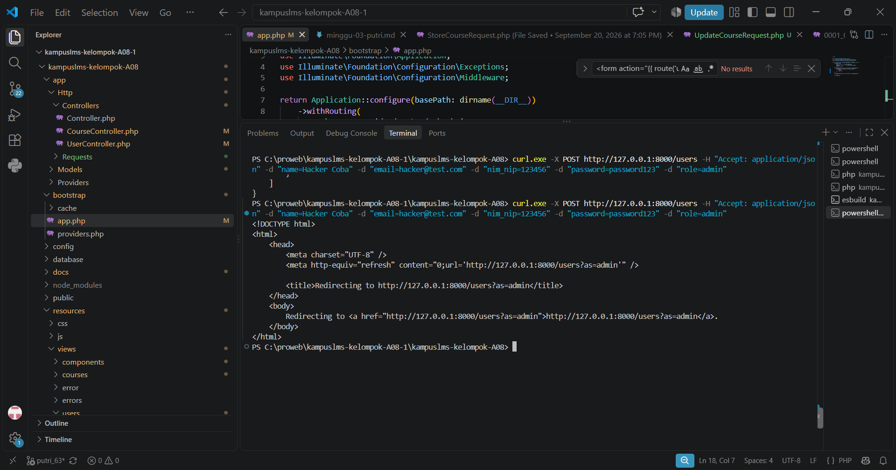
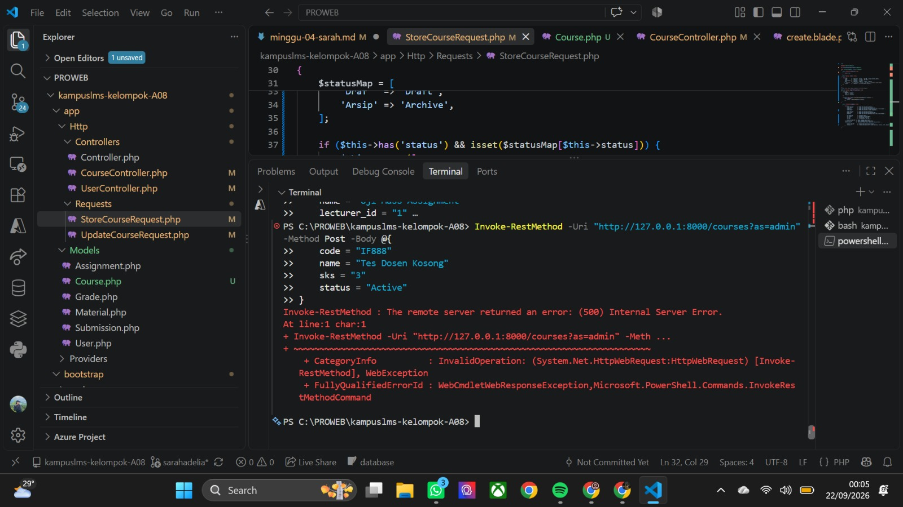
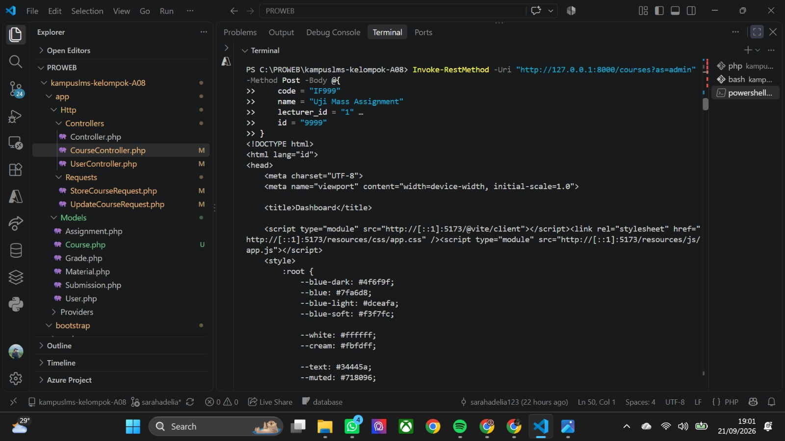
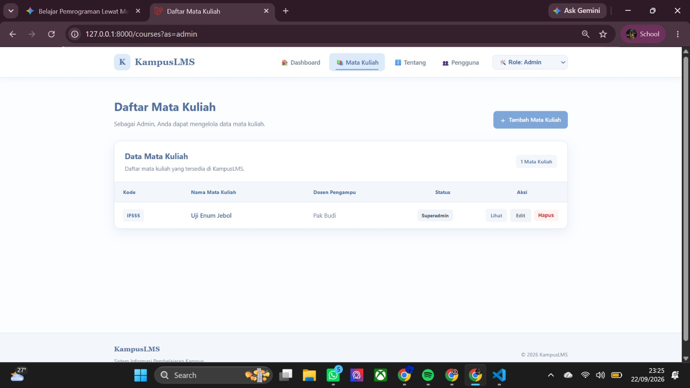
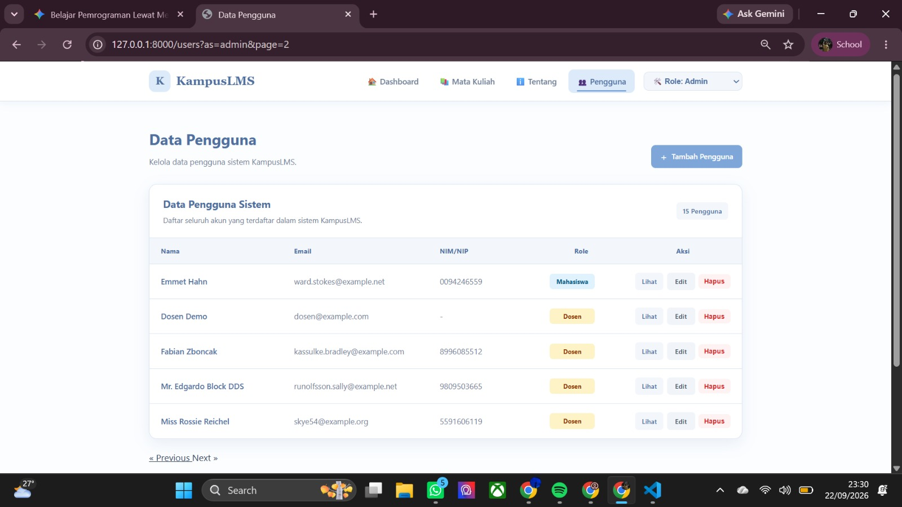
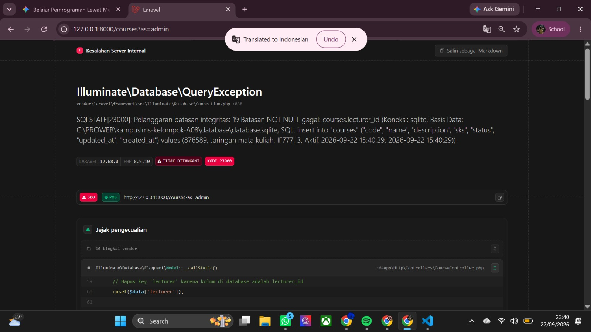

### Read 

1.  Method apa yang menerima request? Di controller mana?
    jawaban : 

    method yang menerima ialah `store()` di file `app/http/Controllers/coursecontroller`. untuk alurnya pertama dari `Routes/web.php` yang menerima request bernilai post/courses  yang secara otomatis ke `method store()` di `coursecontroller`. dan sebelum kode didalam method `store` dijalankan maka laravel akan memproses request tersebut melalui `StoreCourseRequest`. karena itulah saat payload cURL dikirim, validasi di StoreCourseRequest akan menghadangnya sebelum data sempat masuk ke database

2. Di titik mana persisnya validasi terjadi — sebelum atau sesudah baris pertama method controller?
    jawaban : 
    
    Validasi terjadi sebelum baris pertama dari method `controller` dieksekusi. Ketika request dikirim laravel akan langsung menyerahkan data ke form request terlebih dahulu sebelum mengizinkan data masuk ke `controller`, memastikan nilai SKS tidak lebih dari batas maksimal. Jika data yang diisi tidak valid, proses akan langsung dihentikan. Kode utama akan benar benar dieksekusi hanya jika seluruh data formulir sudah lolos diperiksa oleh form request

3. Ke mana Laravel me-redirect setelah gagal? Siapa yang menentukan tujuannya?

    Jawaban : 

    Ketika validasi gagal. laravel secara otomatis me redirect pengguna kembali ke halaman form dan yang menentukan tujuan nya adalah sistem penanganan form request bawaan laravel. sistem ini membaca header HTTP referer yang dikirimkan oleh browser untuk mengetahui URL asal halaman form tersebut dan langsung mengarahkan pengguna kembali. 

4. Dari mana @error('sks') mengambil pesannya?

    Jaawaban :
     @error('sks') mengambil pesannya dari Session Flash Data pada variabel `$errors` (Error Bag). Saat validasi gagal, Laravel otomatis menyimpan daftar pesan kesalahan ke dalam session sementara. Fungsi `@error` lalu membaca pesan yang cocok dengan kunci yang ditentukan (sks) dari variabel `$errors` tersebut untuk ditampilkan di halaman form.

5. Dari mana old('sks') mengambil nilainya? Berapa lama nilai itu bertahan?

    Jawaban : 
    
    old('sks') mengambil nilainya dari Session Flash Data yang berisi data input dari request sebelumnya (dikirim otomatis oleh Laravel lewat method withInput() saat validasi gagal). Nilai tersebut bertahan selama 1 kali request berikutnya saja (flash data). Begitu halaman form dirender atau dimuat ulang sekali oleh pengguna, data old('sks') akan langsung terhapus otomatis dari session.

6. Buka DevTools → Application → Cookies. Temukan cookie session Laravel. Catat namanya.

    jawaban : 
    
    Pada DevTools bagian Application, Cookies, nama cookie session Laravel biasanya adalah laravel_session. Cookie tersebut digunakan Laravel untuk mengenali session pengguna.

    

## Break 

1.  Hapus @csrf dari form, lalu kirim.

    Jawaban : 

    directive `@csrf` pada Blade berfungsi menyisipkan token acak (CSRF token) ke dalam form sebagai bukti bahwa permintaan berasal dari pengguna sah. Token ini diperiksa oleh Middleware CSRF di sisi server setiap kali form dengan metode POST, PUT, atau DELETE dikirimkan. Jika token tidak cocok atau tidak ada, Laravel akan langsung memblokir permintaan dan menampilkan error `419 | PAGE EXPIRE`D. Meski begitu, sistem keamanan ini tetap bergantung pada konfigurasi middleware. Jika suatu route dimasukkan ke dalam daftar pengecualian CSRF (except array), middleware akan melewati proses pemeriksaan token. Hasilnya, form pada route tersebut tetap dapat terkirim dan diproses server meskipun directive `@csrf` dihapus dari kode Blade.

   

2. Ganti $`request->validated()` menjadi `$request->all()`, lalu kirim field liar lewat `curl`

    Jawaban : 
    Simulasi penyerangan celah keamanan Mass Assignment terjadi karena aplikasi dipaksa menggunakan kode `$request->all()` pada controller. Kode ini membuat sistem menerima seluruh input yang dikirimkan oleh pihak luar tanpa ada penyaringan terlebih dahulu. Saat perintah `cURL` dijalankan dengan menyisipkan data `role=admin`, aplikasi langsung meloloskannya begitu saja tanpa validasi hak akses. Akibatnya, data pengguna baru bernama Hacker Coba berhasil masuk ke database dengan peran sebagai Admin, yang ditandai dengan respon pengalihan halaman (redirect) pada terminal.Dampak utamanya adalah pengambilalihan hak akses (privilege escalation). Pihak luar bisa mengubah dirinya menjadi Admin hanya dengan menyisipkan parameter `role=admin` saat mengirim data. Setelah jadi Admin, mereka bebas mengubah, menghapus, atau merusak seluruh data sensitif yang ada di dalam sistem.

    

3. Hapus validasi exists:users,id pada lecturer_id, kirim lecturer_id=99999

    Jawaban : 
    Hasil percobaan membuktikan bahwa FormRequest (lapisan validasi) bertindak sebagai garda terdepan untuk menyaring data sebelum mencapai database, bukan sekadar pemformat input. Tanpa validasi ini, input yang keliru akan langsung menabrak skema database dan memicu `Server Error (500)`, daripada menampilkan pesan peringatan yang informatif. Selain itu, jika skema database mengizinkan nilai nullable, data tanpa relasi dosen akan tetap tersimpan dan menjadi data yatim tanpa penanggung jawab yang jelas.

    

4.  Hapus validasi in:... pada status, kirim status=superadmin

    Jawaban : 
   
   Percobaan pembobolan nilai status menggunakan `"superadmin"` berhasil masuk ke database. Penyebab utamanya adalah dicopotnya validasi `in:` pada `StoreCourseRequest.php` dan diubahnya tipe data kolom status menjadi string biasa. Akibatnya, sistem menerima input nilai yang tidak sah dan dapat merusak alur logika bisnis aplikasi.

   Percobaan 

   

   Hasil : 

   

5. Hapus ->withQueryString(), lakukan pencarian lalu klik halaman 2

    Jawaban :

    Penggunaan metode `withQueryString()` sangat krusial agar parameter filter pada URL tetap terjaga saat terjadi perpindahan halaman paginasi. Tanpa fungsi ini, variabel pencarian seperti `&search=Dosen` akan hilang sewaktu pengguna beralih ke halaman 2, menyisakan parameter halaman utama seperti `?as=admin&page=2`. Akibatnya, filter otomatis terlepas dan data yang ditampilkan kembali ke status awal/keseluruhan.

    

6. Ganti return redirect() menjadi return view() pada store, lalu tekan F5 setelah simpan

    Jawaban :

    Penggunaan return `view()` setelah proses simpan data menyebabkan browser bertahan pada kondisi HTTP POST. Jika halaman di-refresh (F5), form akan terkirim kembali dan mengakibatkan data ganda atau crash `(Error 500)` akibat konflik basis data. Sebaliknya, pendekatan `return redirect()` memanfaatkan pola Post/Redirect/Get (PRG) yang mengalihkan akses ke HTTP GET. Alhasil, tindakan refresh hanya akan memperbarui tampilan dan tidak mengeksekusi ulang proses penyimpanan data.

    

7.  Hapus old(...) dari semua input, lalu kirim form dengan satu kesalahan

    Jawaban : 

    Tanpa atribut `require`d di sisi klien (HTML), validasi ditangani sepenuhnya oleh backend. Ketika terjadi kegagalan validasi, pengguna akan diarahkan kembali ke form penambahan. Jika helper `old()` tidak digunakan pada elemen input, seluruh data yang sudah dimasukkan pengguna akan terhapus otomatis dan form kembali dalam kondisi kosong.

    

    