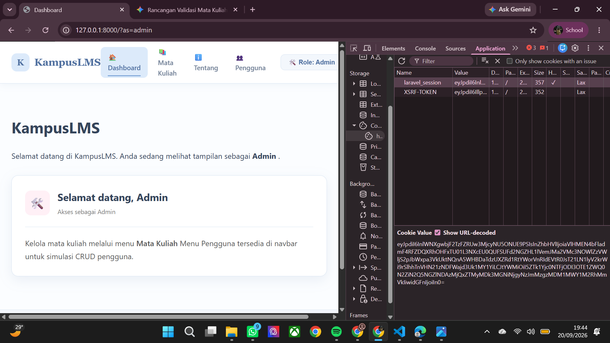
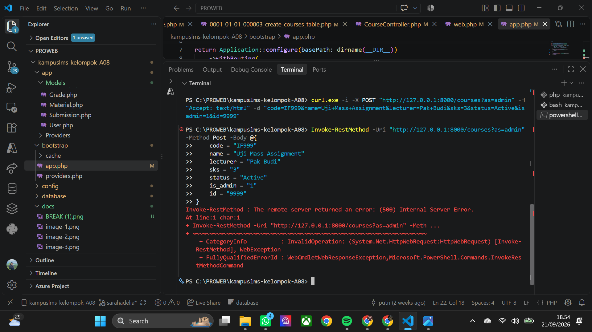
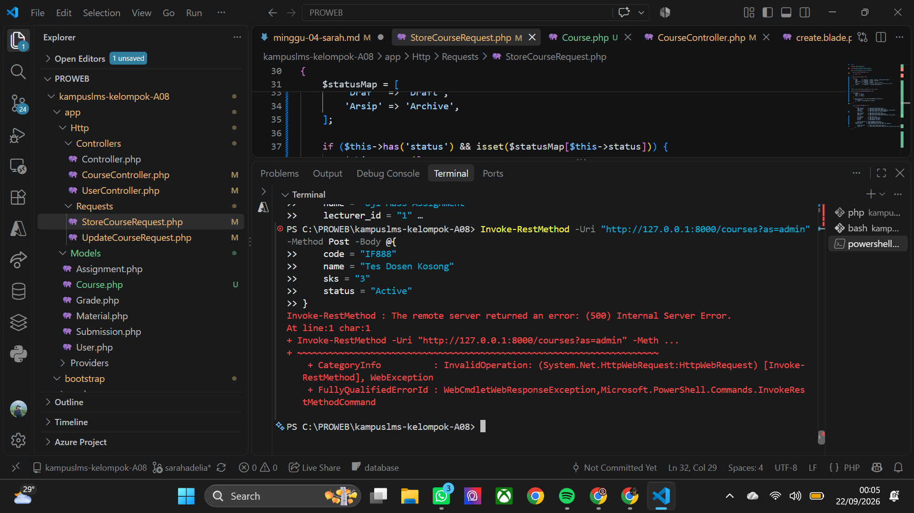
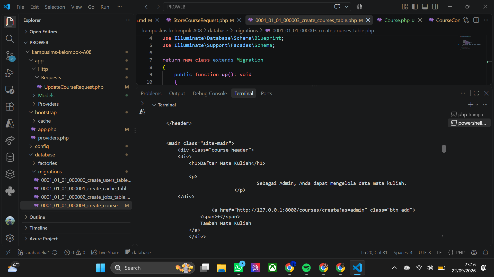
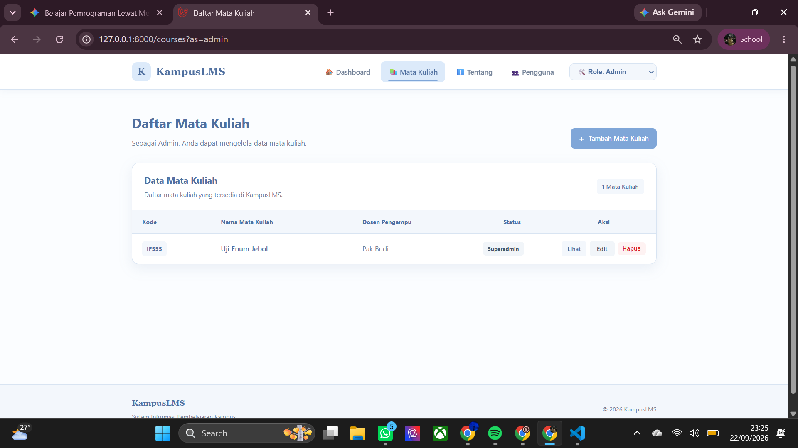
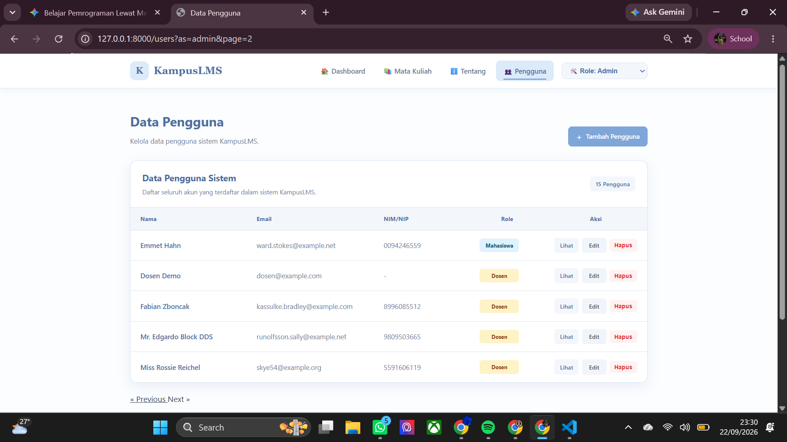
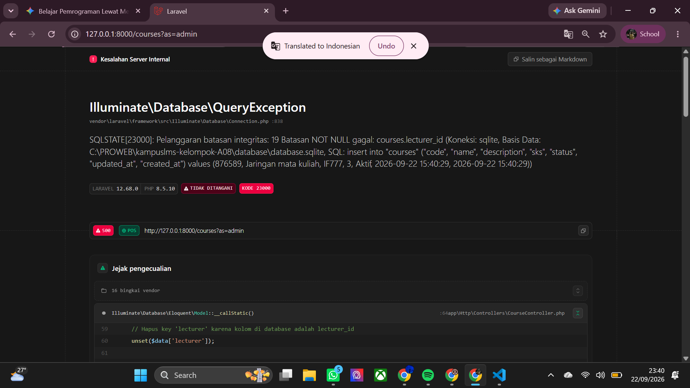
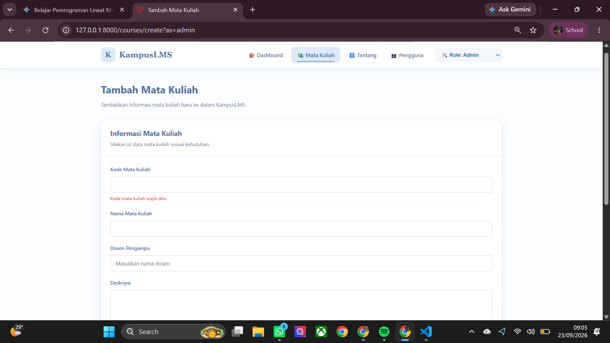

## READ

### 1. Method apa yang menerima request? Di controller mana?

*jawaban*

method yang menerima ialah `store()` di file app/http/Controllers/coursecontroller. untuk alurnya pertama dari `Routes/web.php` yang memetakan request bernilai `post/courses`  yang secara otomatis ke method `store()` di coursecontroller. dan sebelum kode didalam method `store` dijalankan maka laravel akan memproses request tersebut melalui `StoreCourseRequest`. karena itulah saat payload cURL dikirim, validasi di `StoreCourseRequest` akan menghadangnya sebelum data sempat masuk ke database. 

### 2. Di titik mana persisnya validasi terjadi — sebelum atau sesudah baris pertama method `controller?`

*jawaban*

Validasi data pada Laravel terjadi sebelum baris pertama method `controller` dijalankan. Ketika request dikirim ke rute `POST /courses`, Laravel menggunakan mekanisme `Dependency Injection` untuk membaca `StoreCourseRequest` terlebih dahulu. Sistem secara otomatis memeriksa otorisasi dan aturan validasi di dalam kelas tersebut. Jika ada data yang tidak sesuai, eksekusi program langsung dihentikan, lalu Laravel mengembalikan respon error validasi (HTTP 422). Kode di dalam `CourseController` sama sekali tidak tersentuh apabila validasi gagal.

### 3. Ke mana Laravel `me-redirect` setelah gagal? Siapa yang menentukan tujuannya?

*jawaban*

Validasi Laravel berjalan sebelum `controller` dieksekusi. jika data tidak valid, kode `controller` tidak akan pernah tersentuh. Kegagalan validasi akan di-redirect kembali ke halaman form sebelumnya untuk pengguna browser (berdasarkan header HTTP_REFERER), sedangkan untuk `API/cURL` langsung mengembalikan respon JSON HTTP 422.

### 4. Dari mana `@error('sks')` mengambil pesannya?

*jawaban*

Directive `@error('sks')` mengambil pesan error dari Session Flash Data `($errors MessageBag)` yang dikirim Laravel saat validasi S`toreCourseRequest` gagal. 
Isi pesannya berasal dari `method messages()` di file `Form Request` atau file bawaan `validation.php`, lalu disimpan sementara di `session` dan dibaca oleh Blade melalui variabel `$message`.

### 5. Dari mana `old('sks')` mengambil nilainya? Berapa lama nilai itu bertahan?

*jawaban*

`old('sks')` mengambil nilainya dari `Session Flash` Data bawaan Laravel. Ketika validasi di `StoreCourseRequest` gagal, Laravel secara otomatis menyimpan seluruh input yang diketik oleh pengguna ke dalam `session` sementara melalui perintah `withInput()` sebelum melakukan `redirect` kembali ke halaman form. Nilai ini hanya bertahan sangat singkat, yaitu selama satu kali request saja (single HTTP request). Karena menggunakan mekanisme `flash data`, input lama tersebut akan langsung dihapus secara otomatis dari `session` setelah halaman form selesai dimuat ulang (refresh) atau diakses kembali oleh pengguna.

### 6. Buka DevTools → Application → Cookies. Temukan cookie session Laravel. Catat namanya.

*jawaban*

namanya `laravel_session` dan `XSRF-TOKEN` 

## Break 

### 1. Hapus `@csrf` dari form, lalu kirim.

*jawaban*

.png>)

Fungsi `@csrf` Merupakan instruksi Blade untuk menyisipkan hidden input berisi token acak. Token ini dicocokkan oleh Laravel untuk memastikan permintaan berasal dari pengguna sah, bukan serangan dari pihak luar . Jika formulir bertipe `POST/PUT/DELETE` dikirim tanpa token `CSRF`, Laravel secara otomatis memblokir permintaan tersebut dan menampilkan `halaman 419 | PAGE EXPIRED`. di bagian ini ternyata saya menemukan bahwa selain dari `@csrf`, yang berfungsi adalah peran `middlewere`. Jika sebuah `route ` dimasukkan ke dalam daftar pengecualian maka form akan tetap terkirim tanpa pengecualian. 

### 2. Ganti `$request->validated()` menjadi `$request->all()`, lalu kirim field liar lewat `curl`

*jawaban*

hasil percobaan

Menggunakan `$request->all()` menghilangkan penyaringan data di tingkat Controller, sehingga menyerahkan seluruh kontrol keamanan data sepenuhnya kepada Model. Karena Model menggunakan `$fillable`, serangan Mass Assignment via `cURL/PowerShell` berhasil dicegah karena `Eloquent` otomatis membuang field liar sebelum masuk ke database. Celah Mass Assignment baru akan menembus database atau merusak jalannya aplikasi (Server Crash 500) jika Model menggunakan `$guarded = []`

### 3. Hapus validasi exists:users,id pada lecturer_id, kirim lecturer_id=99999

*jawaban*

hasil percobaan

 Hasil percobaan membuktikan bahwa fungsi `FormRequest` (Validation Layer) bukan hanya untuk merapikan input pengguna, melainkan berfungsi sebagai Garda Depan (First Line of Defense) untuk mencegah data yang tidak valid/tidak lengkap menyentuh database.Tanpa adanya validasi di `FormRequest`, kesalahan input akan langsung menghantam skema database dan menyebabkan aplikasi `crash (Error 500)` alih-alih memberikan pesan peringatan yang rapi kepada pengguna.Jika skema database di panduan mensyaratkan kolom tersebut nullable, data tanpa dosen memang akan lolos dan menjadi `data yatim` (data tanpa relasi/penanggung jawab yang jelas).

### 4. Hapus validasi in:... pada status, kirim `status=superadmin`

*jawaban*

Hasil percobaan 

Output 

Hasil percobaan Status Jebol  dengan status  `"superadmin"` berhasil lolos melewati validasi dan resmi tersimpan ke dalam database. Penyebab utamanya `Validasi in:Active,Draft,Archive di StoreCourseRequest.php` dihapus dan Tipe data kolom status di `migrasi` database dilonggarkan menjadi `string` sehingga di `FormRequest,` pengguna bisa memasukkan nilai status `liar/invalid` yang berpotensi merusak logika bisnis aplikasi. 

### 5. Hapus `->withQueryString()`, lakukan pencarian lalu klik halaman 2

*jawaban*

hasil perobaan 

Jika sebelumnya ketika menambahkan parameter seperti `&search=Dosen` atau `&role=Mahasiswa` di URL, begitu kamu menekan tombol Next atau tombol angka halaman 2, parameter tersebut hilang begitu saja dan hanya menyisakan `?as=admin&page=2`. Dan Tanpa `method` `withQueryString()`, tautan `pagination` yang digenerate oleh Laravel tidak akan mempertahankan kondisi pencarian/filter pengguna. Hal ini memaksa halaman kembali menampilkan seluruh data umum tanpa filter setiap kali pengguna berpindah halaman.

### 6. Ganti return `redirect()` menjadi return `view()` pada `store`, lalu tekan F5 setelah simpan

*jawaban*

hasil percobaan

Skenario Menggunakan return view() (Bug Terbukti):

Browser tetap berada pada metode `HTTP POST`. Saat pengguna tidak sengaja menekan `F5`, browser akan mengeksekusi ulang pengiriman form. Hal ini menyebabkan data ganda tersimpan (jika tidak ada batasan unique), atau server mengalami `crash / Error 500` (karena memicu duplicate entry / constraint violation seperti pada gambar).Skenario Menggunakan `return` `redirect()`Setelah proses simpan data `POST` selesai, server langsung mengalihkan browser ke metode `HTTP GET` `via redirect()`. Jika pengguna menekan F5, yang di-refresh hanyalah tampilan data (GET), sehingga aman dari eksekusi simpan ulang.

### 7. Hapus `old(...)` dari semua input, lalu kirim form dengan satu kesalahan

*jawaban*

hasil percobaan

Saat atribut required di HTML dihapus, validasi diserahkan sepenuhnya ke `backend Laravel`. Ketika validasi gagal (misalnya karena code wajib diisi), pengguna dilempar balik ke `form`dan tanpa `old()`, semua inputan panjang yang sudah diketik tadi langsung hangus/bersih.