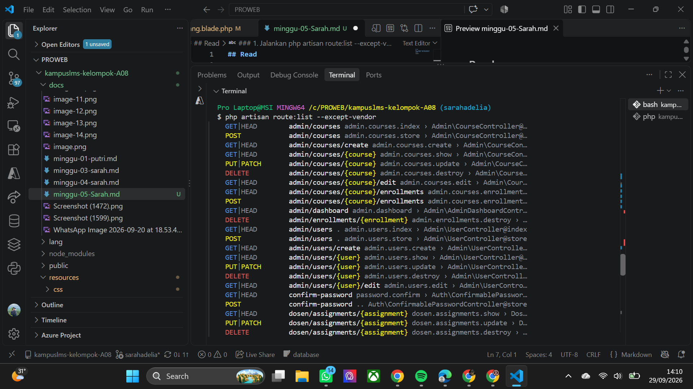
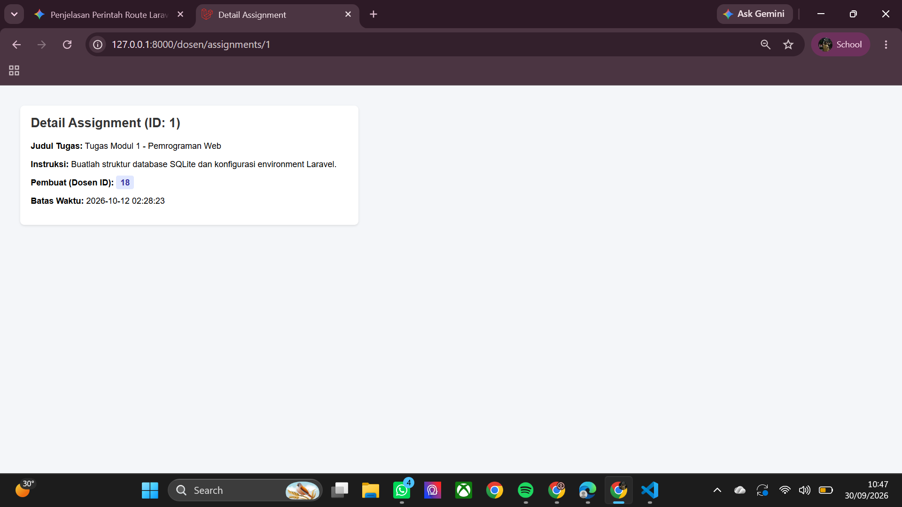
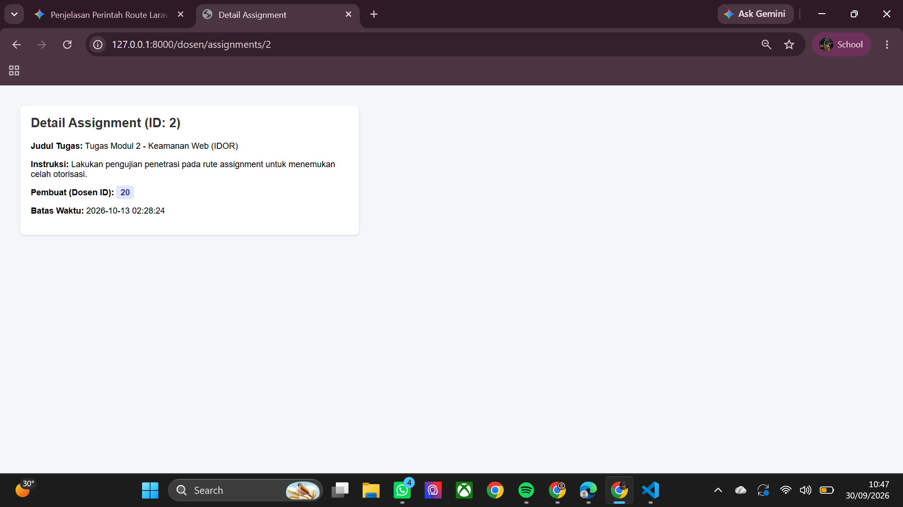
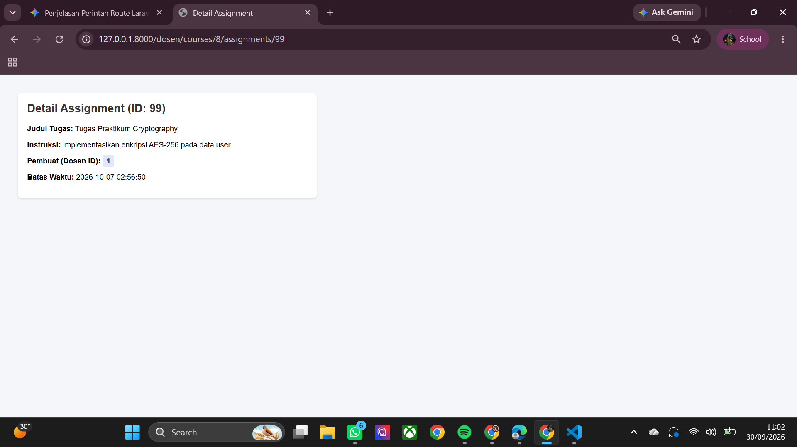
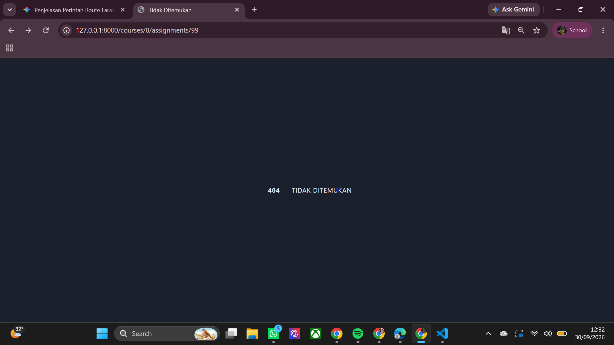
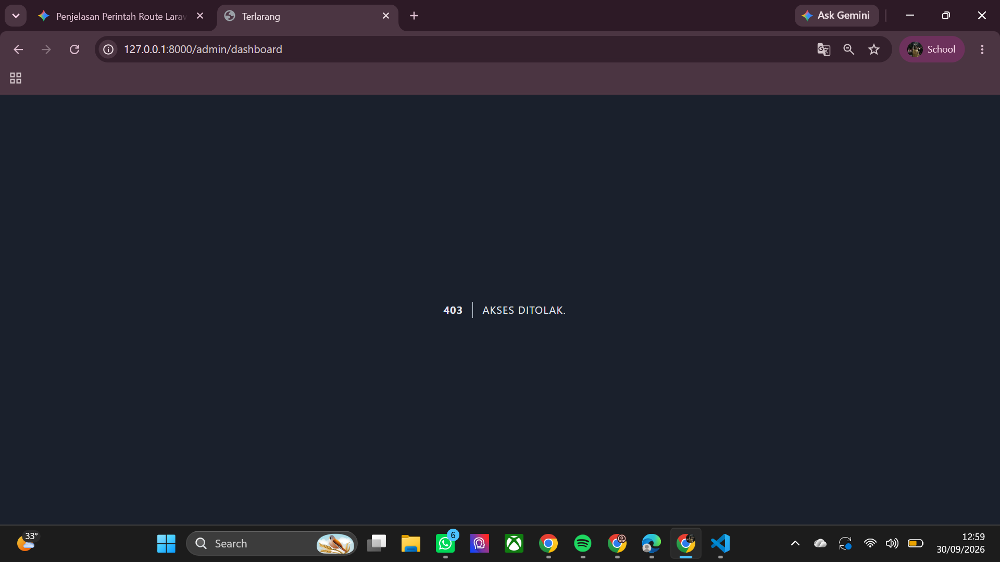
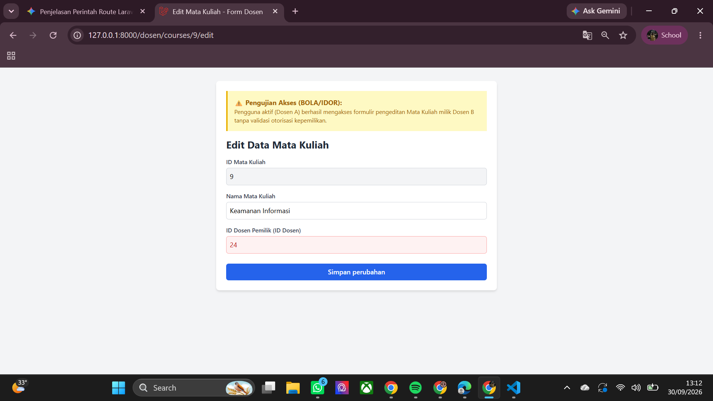

## Read 

### 1. Jalankan `php artisan route:list --except-vendor`. Salin keluarannya ke catatan.

*jawaban*

ketika saya menjalankan diterminal `php artisan route:list --except-vendor` maka yang keluar adalah fungsi yang menampilkan daftar seluruh alur `URL (route)` bawaan proyek Laravel. Daftar ini mencantumkan metode `HTTP (GET, POST, PUT, DELETE)`, alamat URL (seperti admin/courses atau admin/users), nama `route`, serta `Controller` yang bertugas memproses halaman atau data tersebut. Perintah     `--except-vendor` digunakan agar daftar yang muncul hanya berfokus pada fitur proyek Anda tanpa tercampur route dari pustaka luar.

### 2. Tandai setiap route yang menerima parameter model `({course}, {assignment}, dst).`

*jawaban*

1.  Parameter `{course} `

- GET|HEAD `admin/courses/{course} (Route: admin.courses.show)` 

- PUT|PATCH `admin/courses/{course} (Route: admin.courses.update)`  
  
- DELETE `admin/courses/{course} (Route: admin.courses.destroy)` 
   
-  GET|HEAD `admin/courses/{course}/edit (Route: admin.courses.edit)`  
     
- GET|HEAD `admin/courses/{course}/enrollments (Route: admin.courses.enrollments.index)`  
    
-  POST `admin/courses/{course}/enrollments (Route: admin.courses.enrollments.store)` 

2. Parameter `{enrollment}`

- DELETE `admin/enrollments/{enrollment} (Route: admin.enrollments.destroy)`

3. Parameter `{user}`

- GET|HEAD `admin/users/{user} (Route: admin.users.show)` 

- PUT|PATCH `admin/users/{user} (Route: admin.users.update)`  
 
- DELETE `admin/users/{user} (Route: admin.users.destroy)` 
  
- GET|HEAD `admin/users/{user}/edit (Route: admin.users.edit)`

4. Parameter `{assignment}`

- GET|HEAD dosen/assignments/{assignment} (Route: dosen.assignments.show) 

- PUT|PATCH dosen/assignments/{assignment} (Route: dosen.assignments.update)   
  
- DELETE dosen/assignments/{assignment} (Route: dosen.assignments.destroy)   

### 3. Untuk setiap route bertanda, jawab: siapa saja yang seharusnya boleh mengaksesnya, dan apa yang saat ini mencegah orang lain? Kemungkinan besar jawabannya "belum ada apa-apa" — itu wajar, dan itulah pekerjaan minggu ini dan minggu 7.

*jawaban*

1. Group Route `{course} & {enrollment}`

- Siapa yang seharusnya boleh mengakses:

    - Admin: Hak penuh untuk melihat detail `(show)`, memperbarui `(update)`, menghapus `(destroy)`, serta mengelola/menambahkan pendaftaran mahasiswa `(enrollments)`

    - Dosen / Mahasiswa: Hanya boleh melihat `(show)` jika terdaftar pada mata kuliah tersebut (tergantung aturan bisnis aplikasi).

- Apa yang saat ini mencegah orang lain:

    - Secara umum di Laravel, pembatasan dasar berada pada `Middleware Authentication` (misal: auth), tetapi untuk membedakan peran (Admin vs Dosen/Mahasiswa) atau memastikan user hanya bisa mengubah data miliknya, diperlukan `Middleware Role/Permission atau Laravel Gate / Policy`.

    - Jika aturan tersebut belum dibuat di `controller`  atau `route definition`, maka belum ada apa-apa yang mencegah user login biasa `(atau bahkan guest`, jika belum dipasang `middleware auth` untuk mengakses URL tersebut.

2. Group Route `{user}`

- Siapa yang seharusnya boleh mengakses:

    - Admin: Akses penuh untuk melihat detail user lain, mengubah data user, atau menghapus user `(destroy)`.

    - User Pemilik Akun: Hanya boleh melihat atau mengedit profil miliknya sendiri`(misal: /users/{id} tempat {id} adalah ID dirinya sendiri)`.

- Apa yang saat ini mencegah orang lain:

    - Belum ada apa-apa (atau baru sebatas middleware auth standar jika sudah terpasang). Tanpa `Policy` contoh: `UserPolicy@update`, seorang user biasa yang menebak ID user lain di `URL (admin/users/5/edit)` masih bisa mengakses atau mengubah data user tersebut.

3. Group Route `{assignment}`

- Siapa yang seharusnya boleh mengakses:

    - Dosen: Hanya dosen pengampu mata kuliah terkait yang boleh melihat, mengedit, atau menghapus tugas `(assignment)` tersebut.
    
    - Mahasiswa: Hanya boleh melihat `(show)` tugas dari kelas yang diikuti, tanpa akses ke `update` atau `destroy`

- Apa yang saat ini mencegah orang lain:

    - Belum ada apa-apa. Tanpa pemeriksa otorisasi `(seperti Authorize middleware atau $this->authorize('update', $assignment)` di dalam `Controller`, dosen A bisa saja sengaja/tidak sengaja mengubah tugas milik dosen B hanya dengan mengganti `ID {assignment}` pada URL.

### 5. Buat tabel di `docs/minggu-05-<nama>.md` berjudul "Daftar Titik Rawan IDOR". Tabel ini akan Anda pakai lagi di minggu 7 dan saat interview.

*jawaban*

## Daftar Titik Rawan IDOR

Tabel berikut mencatat seluruh `route` yang menerima parameter model (seperti `{course}`, `{user}`, `{assignment}`, dll.) yang berpotensi menjadi titik kerentanan `IDOR (Insecure Direct Object Reference)` jika tidak dilindungi dengan proteksi otorisasi yang memadai misal: `Middleware Role/Permission, Gate, atau Policy`.

| No | Method | Route / Path | Parameter | Hak Akses Ideal (Who Should Access) | Mekanisme Pencegahan Saat Ini | Potensi Risiko IDOR |
|:--:|:------:|:-------------|:---------:|:------------------------------------|:------------------------------|:--------------------|
| 1 | `GET\|HEAD` | `admin/courses/{course}` | `{course}` | Admin, Dosen/Mahasiswa terkait | Belum ada apa-apa / Middleware `auth` dasar | Pengguna dapat melihat detail course yang tidak seharusnya diakses hanya dengan mengganti ID course di URL. |
| 2 | `PUT\|PATCH` | `admin/courses/{course}` | `{course}` | Admin saja | Belum ada apa-apa | Pengguna non-admin/dosen lain dapat mengubah data course pengguna lain. |
| 3 | `DELETE` | `admin/courses/{course}` | `{course}` | Admin saja | Belum ada apa-apa | Pengguna non-admin dapat menghapus data course milik orang lain. |
| 4 | `GET\|HEAD` | `admin/courses/{course}/edit` | `{course}` | Admin saja | Belum ada apa-apa | Akses ke form edit course tanpa verifikasi peran admin. |
| 5 | `GET\|HEAD` | `admin/courses/{course}/enrollments` | `{course}` | Admin saja | Belum ada apa-apa | Mengintip daftar pendaftaran mahasiswa pada course tertentu. |
| 6 | `POST` | `admin/courses/{course}/enrollments` | `{course}` | Admin saja | Belum ada apa-apa | Menambahkan/mendaftarkan pengguna ke course tanpa izin. |
| 7 | `DELETE` | `admin/enrollments/{enrollment}` | `{enrollment}` | Admin saja | Belum ada apa-apa | Menghapus pendaftaran (*unenroll*) pengguna lain dari course. |
| 8 | `GET\|HEAD` | `admin/users/{user}` | `{user}` | Admin, Pemilik Akun | Belum ada apa-apa | Melihat informasi pribadi/sensitif milik user lain dengan mengganti ID user. |
| 9 | `PUT\|PATCH` | `admin/users/{user}` | `{user}` | Admin, Pemilik Akun | Belum ada apa-apa | Mengubah data profil/akun milik user lain secara ilegal. |
| 10 | `DELETE` | `admin/users/{user}` | `{user}` | Admin saja | Belum ada apa-apa | Menghapus akun user lain secara langsung melalui manipulasi ID. |
| 11 | `GET\|HEAD` | `admin/users/{user}/edit` | `{user}` | Admin, Pemilik Akun | Belum ada apa-apa | Mengakses antarmuka/form edit akun user lain. |
| 12 | `GET\|HEAD` | `dosen/assignments/{assignment}` | `{assignment}` | Dosen pengampu, Mahasiswa kelas terkait | Belum ada apa-apa | Mengintip detail tugas dari kelas/dosen lain. |
| 13 | `PUT\|PATCH` | `dosen/assignments/{assignment}` | `{assignment}` | Dosen pengampu tugas tersebut saja | Belum ada apa-apa | Dosen/user lain dapat mengubah isi atau ketentuan tugas milik dosen lain. |
| 14 | `DELETE` | `dosen/assignments/{assignment}` | `{assignment}` | Dosen pengampu tugas tersebut saja | Belum ada apa-apa | Menghapus tugas milik dosen lain dengan mengganti ID assignment pada request. |

---

*Catatan: Dokumentasi ini dibuat pada Minggu 5 dan akan diperbarui pada Minggu 7 setelah pengujian dan penambahan proteksi `(Policy/Gate)`.

##

## BREAK

### 1. Login sebagai user A. Buka submission milik user B dengan mengubah angka di URL

*jawaban*

secrenshoot: mengakses data sendiri 

secrenshoot 2 : Berhasil mengakses data tugas ID 2 milik user lain (Pembuat ID: 20) tanpa halangan otorisasi.

Berdasarkan hasil `break test` pada endpoint `/dosen/assignments/{id}`, sistem terbukti memiliki celah keamanan `Insecure Direct Object Reference (IDOR)`.  Saat pengguna yang terautentikasi mengubah parameter `URL dari ID 1 ke ID 2`, aplikasi tetap menampilkan detail tugas milik pengguna/dosen lain `(created_by: 20)` tanpa melakukan pengecekan hak kepemilikan `(created_by == Auth::id())`. Hal ini membuktikan bahwa pengontrol tidak memvalidasi `otorisasi entitas` sebelum menyajikan data

### 2. Buka /courses/1/assignments/99 di mana tugas 99 milik mata kuliah lain

*jawaban*

Pengujian rute bersarang `/dosen/courses/{course}/assignments/{assignment}` menunjukkan adanya celah `Broken Object Level Authorization (BOLA)` / `Missing Scoping`. Tugas `ID 99` yang sebenarnya terikat pada Mata Kuliah `ID 9 `tetap dapat diakses melalui URL `Mata Kuliah ID 8 (/dosen/courses/8/assignments/99)`. Hal ini terjadi karena `controller` langsung mengambil data tugas berdasarkan `ID` tanpa memverifikasi kesesuaian relasi `course_id` pada rute induknya

### 3. Aktifkan Route::scopeBindings(), ulangi nomor 2

*jawaban*

hasil :

Setelah mengaktifkan `Route::scopeBindings()` pada rute bersarang, pengujian ulang dengan mengakses `URL /dosen/courses/8/assignments/99` menghasilkan respons `404 | TIDAK DITEMUKAN`. Hal ini terjadi karena fitur `Scope Bindings` Laravel secara otomatis memverifikasi kepemilikan `relasi parent-child` antara `Course dan Assignment`. Karena `Assignment ID 99` sebenarnya terikat pada `Course ID 9 (bukan Course ID 8)`, Laravel langsung menolak akses tersebut dan mengembalikan status `404`, sehingga celah keamanan `BOLA/IDOR` berhasil diatasi

### 4. Daftarkan middleware di app/Http/Kernel.php seperti tutorial lama

*jawaban*

Saat melakukan instruksi pendaftaran `middleware EnsureUserHasRole pada app/Http/Kernel.php`, berkas tersebut tidak ditemukan. Hal ini menandakan proyek menggunakan arsitektur Laravel `versi 12` yang telah mengeliminasi `Kernel.php `demi penyederhanaan struktur aplikasi.

- Solusi & Implementasi:
Sebagai gantinya, pendaftaran `middleware` dilakukan di berkas `bootstrap/app.php` menggunakan rantai metode `->withMiddleware()`. `Middleware` berhasil didaftarkan dengan sintaks `$middleware->alias(['role' => EnsureUserHasRole::class])`, sehingga alias `'role'` tetap dapat dipanggil secara normal pada file rute `(routes/web.php)`.

### 5. Pasang `role:admin` pada grup, lalu akses sebagai dosen

*jawaban*
 hasil pengujian 

Ketika rute grup `Admin (/admin/*)` dipasangi `middleware role:admin`, lalu diakses menggunakan akun dengan role Dosen, sistem berhasil menolak akses dan mengembalikan respons `403 | AKSES DITOLAK`. `Middleware EnsureUserHasRole` yang terdaftar pada alias '`role'` di `bootstrap/app.php` bekerja memeriksa kesesuaian antara peran akun aktif dengan parameter rute. Karena akun yang digunakan ber-role dosen (bukan admin),`middleware` langsung memblokir eksekusi request via `abort(403)`. Hal ini membuktikan bahwa kontrol akses berbasis peran `(Role-Based Access Control)` pada rute aplikasi telah berjalan dengan aman dan efisien.

### 6. Sebagai dosen A, edit mata kuliah milik dosen B (keduanya lolos role:dosen)

*jawaban*

hasil pengujian 

Pengujian akses rute `/dosen/courses/9/edit` menggunakan akun Dosen A menunjukkan adanya celah keamanan `Broken Object Level Authorization (BOLA)` di tingkat horizontal. Meskipun Dosen A dan Dosen B sama-sama lolos dari validasi m`iddleware role:dosen`, aplikasi tetap menampilkan formulir pengeditan mata kuliah Keamanan Informasi (ID 9) yang merupakan milik Dosen B (ID Dosen 24). Kondisi ini terjadi karena pengontrol `DosenCourseController` mengambil data mata kuliah menggunakan `Course::findOrFail($id)` secara langsung tanpa melakukan verifikasi kepemilikan data (lecturer_id). Akibatnya, otorisasi tingkat objek terabaikan sehingga pengguna ber-role sama dapat mengakses dan berpotensi mengubah data milik dosen lain. Untuk menutup celah ini, pengontrol perlu ditambahkan pengecekan relasi kepemilikan terhadap pengguna yang sedang aktif atau memanfaatkan `fitur Policy` pada Laravel.