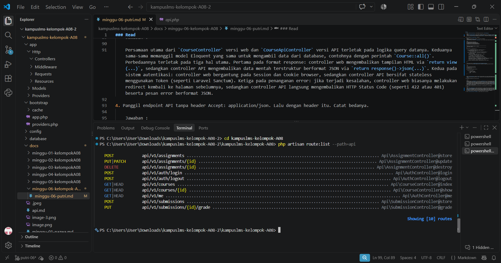

### Read 

1. Jalankan `php artisan install:api`. Baca perubahan yang terjadi di `bootstrap/app.php`.

    Jawaban : 
    
    Perintah `php artisan install:api` secara otomatis menambahkan pendaftaran file `routes/api.php` di dalam rantai metode `withRouting()` pada file `bootstrap/app.php`. Mengaktifkan file `routes/api.php`, Secara otomatis memberikan `prefix /api` untuk seluruh rute yang didaftarkan di dalam file tersebut, Menerapkan middleware group `api` (termasuk rate limiting/throttle dan sifat stateless). 


2. Buat satu endpoint `GET /api/v1/courses` sederhana.

    Jawaban : 
    Untuk membuat endpoint API ini, terdapat 2 file yang perlu ditambahkan :
    - Daftarkan Rute di `routes/api.php`    
    Tambahkan kode berikut ke dalam file `routes/api.php` (file ini otomatis dibuat setelah menjalankan php artisan install:api)

    ```
    <?php
    use Illuminate\Support\Facades\Route;
    use App\Http\Controllers\Api\AuthController;
    use App\Http\Controllers\Api\CourseController;
    use App\Http\Controllers\Api\AssignmentController;
    use App\Http\Controllers\Api\SubmissionController;

    /*
    |--------------------------------------------------------------------------
    | API Routes — KampusLMS (Laravel 12 / Sanctum)
    | Prefix Global: /api/v1
    |--------------------------------------------------------------------------
    */

    Route::prefix('v1')->group(function () {

        // --- 1. AUTENTIKASI PUBLIK (Rate limit: 5 permintaan per menit) ---
        Route::post('/auth/login', [AuthController::class, 'login'])
            ->middleware('throttle:5,1');

        // --- 2. RUTE TERPROTEKSI SANCTUM (Rate limit: 60 permintaan per menit) ---
        Route::middleware(['auth:sanctum', 'throttle:60,1'])->group(function () {

            // Autentikasi Pengguna
            Route::post('/auth/logout', [AuthController::class, 'logout']);
            Route::get('/me', [AuthController::class, 'me']);

            // --- RUTE ORANG 3: Courses, Assignments & Submissions ---
            Route::get('/courses', [CourseController::class, 'index']);
            Route::get('/courses/{id}', [CourseController::class, 'show']);

            Route::post('/assignments', [AssignmentController::class, 'store']);
            Route::match(['put', 'patch'], '/assignments/{id}', [AssignmentController::class, 'update']);
            Route::delete('/assignments/{id}', [AssignmentController::class, 'destroy']);

            Route::post('/submissions', [SubmissionController::class, 'store']);
            Route::put('/submissions/{id}/grade', [SubmissionController::class, 'grade']);
        });

    });
    ```

    - Buat Controller API di `app/Http/Controllers/Api/V1/CourseApiController.php`
    Buat controller baru yang bertugas mengambil data dari database dan mengembalikannya dalam format JSON

    ```
    <?php

    namespace App\Http\Controllers\Api;

    use App\Http\Controllers\Controller;
    use App\Models\Course;

    class CourseController extends Controller
    {
        public function index()
        {
            return response()->json([
                'status' => 'success',
                'data'   => Course::all()
            ], 200);
        }
    }
    ```


    Endpoint `GET /api/v1/courses` adalah jalur akses data untuk aplikasi lain, seperti Frontend React/Vue atau Mobile App. Tidak seperti rute web yang mengirimkan tampilan HTML (`view()`), endpoint API ini khusus mengirimkan data mentah berformat JSON melalui `response()->json()`.

3. Perbandingan CourseController versi Web vs API**


    Jawaban : 

    Persamaan utama dari `CourseController` versi web dan `CourseApiController` versi API terletak pada logika query datanya. Keduanya sama-sama memanggil model Eloquent yang sama untuk mengambil data dari database, contohnya dengan perintah `Course::all()`. Perbedaannya terletak pada tiga hal utama. Pertama pada format response: controller web mengembalikan tampilan HTML via `return view(...)`, sedangkan controller API mengembalikan data mentah terstruktur berformat JSON via `return response()->json(...)`. Kedua pada sistem autentikasi: controller web bergantung pada Session dan Cookie browser, sedangkan controller API bersifat stateless menggunakan Token (seperti Laravel Sanctum). Ketiga pada penanganan error: jika terjadi kesalahan, controller web biasanya melakukan redirect kembali ke halaman sebelumnya, sedangkan controller API langsung mengembalikan HTTP Status Code (seperti 422 atau 401) beserta pesan error berformat JSON.

4. Panggil endpoint API tanpa header Accept: application/json. Lalu dengan header itu. Catat bedanya.

    Jawaban : 
    
    Header `Accept: application/json` berfungsi sebagai penentu cara Laravel merespons sebuah permintaan (*request*). Tanpa header tersebut, Laravel menganggap akses berasal dari browser biasa, sehingga saat terjadi kesalahan autentikasi (401) atau gagal validasi, sistem akan melakukan *redirect* balik ke halaman sebelumnya atau menampilkan error berbentuk HTML. Sebaliknya, jika header `Accept: application/json` ditambahkan, Laravel secara otomatis mengenali *request* tersebut sebagai akses API, sehingga setiap error—mulai dari kegagalan autentikasi hingga masalah validasi—langsung dikembalikan dalam bentuk data JSON yang konsisten beserta kode status HTTP yang sesuai (seperti 401 Unauthorized atau 422 Unprocessable Content) tanpa proses *redirect*.

5. Jalankan `php artisan route:list --path=api`. Cocokkan dengan kontrak di spesifikasi.

    Jawaban : 

    

    Berdasarkan hasil perintah `php artisan route:list --path=api` pada terminal, terdapat 10 rute API yang aktif dengan prefix `/api/v1`. Rute tersebut terbagi atas autentikasi publik (`POST api/v1/auth/login`), autentikasi terproteksi (`POST api/v1/auth/logout` dan GET `api/v1/me`), manajemen mata kuliah (`GET api/v1/courses` dan `GET api/v1/courses/{id}`), pengelolaan tugas (`POST, PUT|PATCH` dan `DELETE` pada `api/v1/assignments`), serta pengumpulan dan penilaian tugas (`POST api/v1/submissions` dan `PUT api/v1/submissions/{id}/grade`). Seluruh endpoint tersebut telah terhubung dengan controller masing-masing di dalam namespace `Api\`.