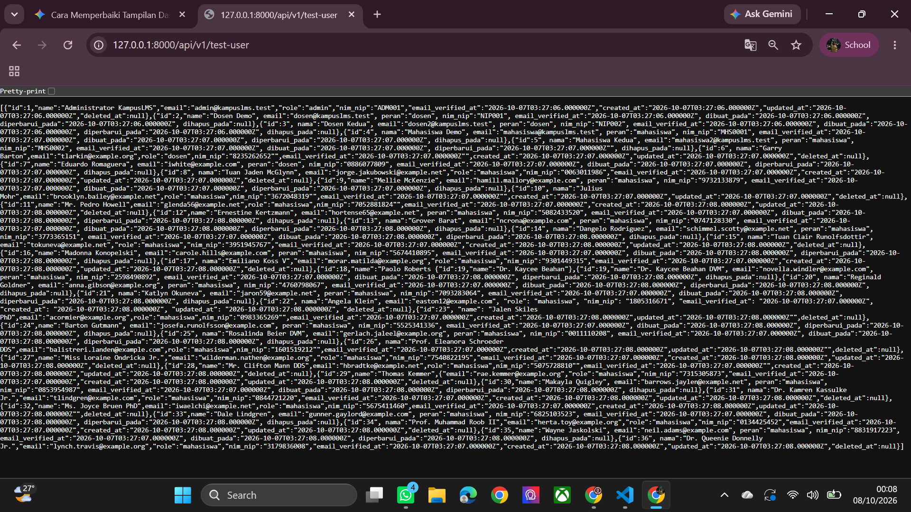
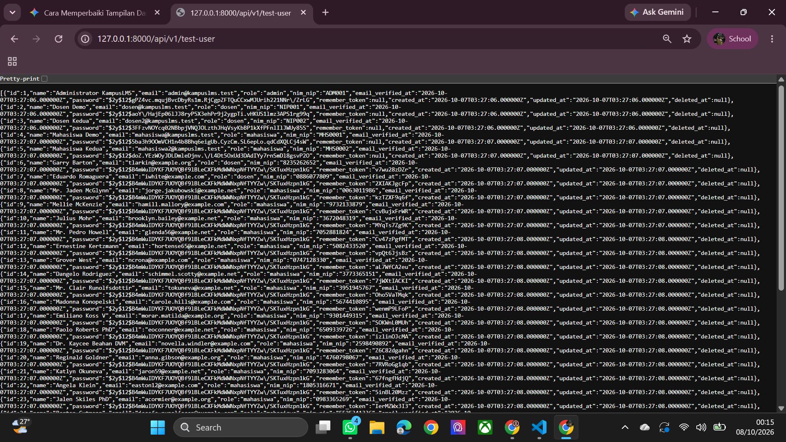
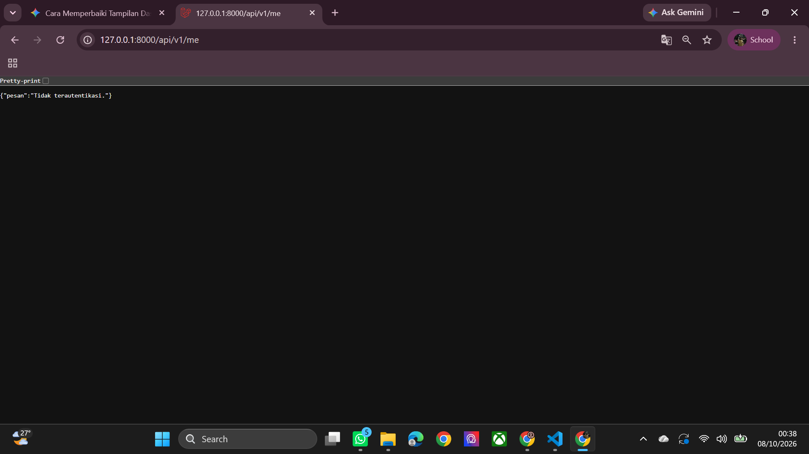
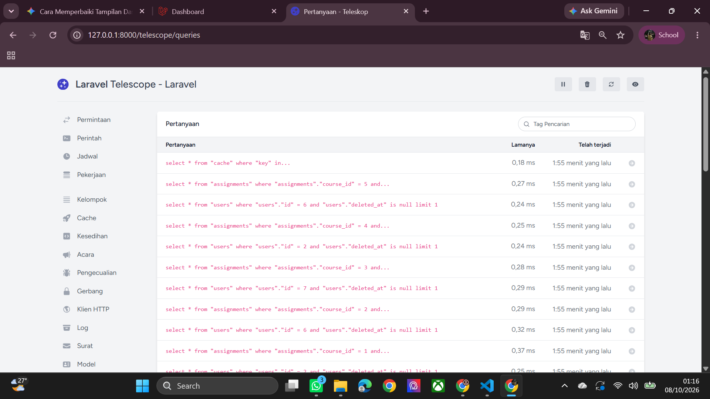
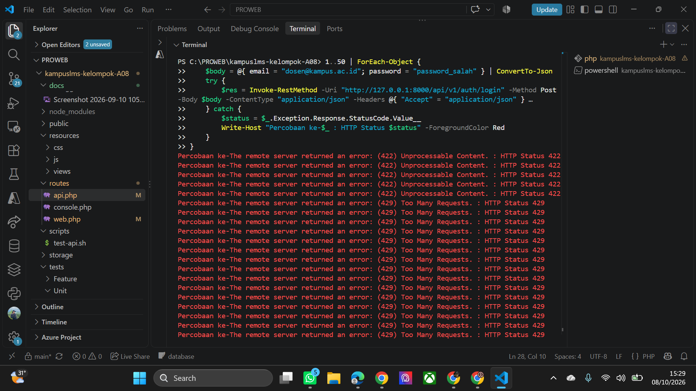
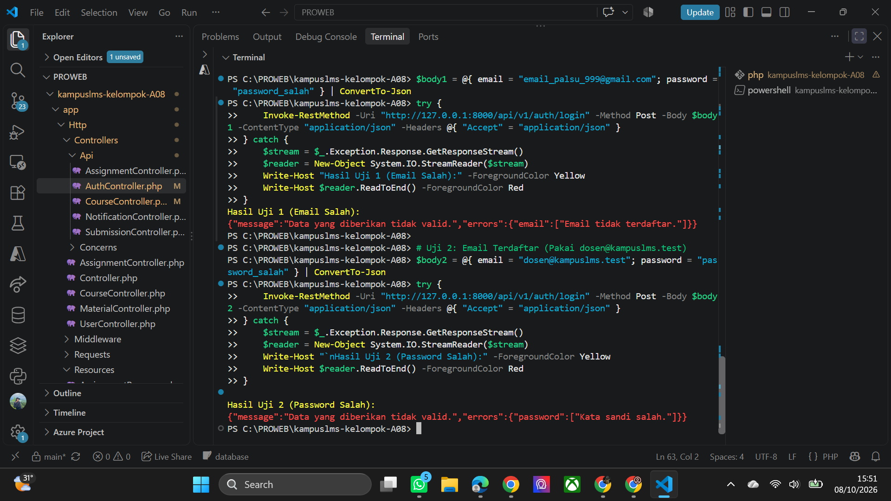

## READ

### 1. Jalankan `php artisan install:api`. Baca perubahan yang terjadi di `bootstrap/app.php.`

*jawaban*

Eksekusi perintah `php artisan install:api` mengubah berkas `bootstrap/app.php` dengan menambahkan pendaftaran rute API pada metode `configuration routing`. Perubahan tersebut mendaftarkan file `routes/api.php` secara otomatis ke dalam aplikasi, sehingga seluruh rute di dalamnya diberi `prefix /api` dan mengaktifkan `middleware API` bawaan Laravel Sanctum untuk menangani autentikasi berbasis token.

### 2. Buat satu endpoint` GET /api/v1/courses` sederhana.

*jawaban*

Kode `GET/api/v1/courses` 

- routes/api.php

```PHP

<?php
use Illuminate\Support\Facades\Route;
use App\Http\Controllers\Api\AuthController;
use App\Http\Controllers\Api\CourseController;
use App\Http\Controllers\Api\AssignmentController;
use App\Http\Controllers\Api\SubmissionController;

/*
|--------------------------------------------------------------------------
| API Routes — KampusLMS (Laravel 12 / Sanctum)
| Prefix Global: /api/v1
|--------------------------------------------------------------------------
*/

Route::prefix('v1')->group(function () {

    // --- 1. AUTENTIKASI PUBLIK (Rate limit: 5 permintaan per menit) ---
    Route::post('/auth/login', [AuthController::class, 'login'])
        ->middleware('throttle:5,1');

    // --- 2. RUTE TERPROTEKSI SANCTUM (Rate limit: 60 permintaan per menit) ---
    Route::middleware(['auth:sanctum', 'throttle:60,1'])->group(function () {

        // Autentikasi Pengguna
        Route::post('/auth/logout', [AuthController::class, 'logout']);
        Route::get('/me', [AuthController::class, 'me']);

        // --- RUTE ORANG 3: Courses, Assignments & Submissions ---
        Route::get('/courses', [CourseController::class, 'index']);
        Route::get('/courses/{id}', [CourseController::class, 'show']);

        Route::post('/assignments', [AssignmentController::class, 'store']);
        Route::match(['put', 'patch'], '/assignments/{id}', [AssignmentController::class, 'update']);
        Route::delete('/assignments/{id}', [AssignmentController::class, 'destroy']);

        Route::post('/submissions', [SubmissionController::class, 'store']);
        Route::put('/submissions/{id}/grade', [SubmissionController::class, 'grade']);
    });

});
```

- Membuat logika di controller dengan menambahkan `app/Http/Controllers/Api/CourseController.php `

``` php

namespace App\Http\Controllers\Api;

use App\Http\Controllers\Controller;
use App\Models\Course;

class CourseController extends Controller
{
    public function index()
    {
        return response()->json([
            'status' => 'success',
            'data'   => Course::all()
        ], 200);
    }
}
```

### 3. Bandingkan dengan `CourseController` versi web yang sudah ada. Tulis di catatan: apa yang sama dan apa yang berbeda di antara keduanya?

*jawaban*

Perbandingan `CourseController` versi Web dan API memiliki persamaan pada penggunaan model Course untuk mengelola data database, aturan validasi data, serta penerapan otorisasi pengguna. Perbedaannya terletak pada hasil kembalian, di mana versi Web mengembalikan tampilan HTML menggunakan Blade template beserta sistem `redirect` dan `session`, sedangkan versi `API` mengembalikan respon `JSON` berstatus code `HTTP` tanpa redirect. Selain itu, versi Web menggunakan autentikasi berbasis session, sementara versi API menggunakan `autentikasi token stateless` melalui `Laravel Sanctum`.

### 4. Panggil endpoint API tanpa header `Accept: application/json`. Lalu dengan header itu. Catat bedanya.

*jawaban*

Perbedaan pemanggilan endpoint API berdasarkan ada atau tidaknya header `Accept: application/json:`

`Tanpa Header Accept: application/json:`

Saat terjadi kesalahan validasi atau kesalahan autentikasi `(401 Unauthorized)`, Laravel menganggap permintaan datang dari browser biasa. Akibatnya, Laravel akan mencoba melakukan `redirect` balik ke halaman login/sebelumnya atau mengembalikan tampilan kesalahan dalam format HTML.

`Dengan Header Accept: application/json:`

Laravel secara eksplisit mengenali permintaan tersebut sebagai permintaan API. Jika terjadi kegagalan validasi, kesalahan `autentikasi`, atau error sistem, Laravel tidak akan melakukan `redirect` maupun mengirim HTML, melainkan langsung mengembalikan struktur data kesalahan dalam format JSON yang konsisten beserta kode status HTTP yang sesuai (seperti` 401 Unauthorized` atau `422 Unprocessable Content`).

### 5. Jalankan `php artisan route:list --path=api`. Cocokkan dengan kontrak di spesifikasi.

*jawaban*
.png>)

Hasil perintah `php artisan route:list --path=api/v1` pada terminal menunjukkan bahwa seluruh 16 rute API KampusLMS telah terdaftar secara lengkap dan tepat sesuai kontrak spesifikasi. Seluruh    `endpoint` utama—mulai dari `autentikasi publik` dan terproteksi, manajemen mata kuliah beserta `materials` dan `assignments ter-nested`, pengumpulan serta penilaian submissions, hingga modul notifications—telah terhubung ke controller yang sesuai di bawah `prefix /api/v1` tanpa adanya duplikasi.


## BREAK 


### 1. Kembalikan `response()->json(User::all())` di satu endpoint uji

*jawaban*

hasil pengujian Mengembalikan `response()->json(User::all())`

- sebelum menyembunyikan `$hidden`



- setelah menyembunyikan `$hidden`



#### hasil : 

Eksperimen ini menunjukkan bagaimana Laravel mengelola keamanan data sensitif saat mengembalikan respons `JSON `melalui `endpoint API`. Ketika kita memanggil fungsi `User::all()`, Laravel secara otomatis mengubah seluruh data objek dari database menjadi format JSON yang menampilkan detail pengguna seperti `ID, nama, email, hingga nomor induk`. Namun, secara bawaan, kolom krusial seperti `password `dan `remember_token` tetap tersembunyi karena dilindungi oleh properti `$hidden` yang ada pada file model `User.php`. Saat properti `$hidden` tersebut dihapus atau dinonaktifkan, Laravel tidak lagi memfilter kolom sensitif, sehingga hash password pengguna ikut terekspos secara terbuka di dalam response API. Hal ini membuktikan pentingnya fitur pemfilteran atribut pada ORM Eloquent untuk mencegah kebocoran data sensitif yang dapat membahayakan keamanan sistem jika diakses oleh pihak yang tidak berwenang.


### 2. Hapus `auth:sanctum` dari grup route, panggil tanpa token

*jawaban*

hasil pengujian : 

.png>)

Eksperimen ini membuktikan dampak dari pencabutan `middleware auth:sanctum` pada rute API. Ketika batasan keamanan tersebut dilepas dan controller dikondisikan tanpa pemeriksaan peran pengguna, seluruh data internal—seperti daftar mata kuliah beserta profil pengajarnya—menjadi terekspos secara publik. Siapa saja dapat mengakses endpoint tersebut secara bebas melalui browser tanpa memerlukan proses login maupun `token autentikasi`. Hal ini menegaskan bahwa middleware berperan sangat krusial sebagai fondasi keamanan dalam membatasi hak akses data pada sistem API.

### 3. Panggil endpoint terlindungi dengan token yang sudah dihapus

*jawaban*

hasil pengujian : 



pengujian  ini membuktikan mekanisme validasi token serta penanganan respons kegagalan `autentikasi` pada `API Laravel Sanctum`. Ketika endpoint terproteksi seperti `/api/v1/me` dipanggil menggunakan token yang telah dihapus dari database `(tabel personal_access_tokens)`, `middleware auth:sanctum` menolak permintaan tersebut karena tidak dapat mencocokkan identitas pengguna yang valid. Dengan hadirnya named route login sebagai `fallback` untuk penanganan `unauthenticated`, sistem berhasil menghentikan proses pengalihan (redirect) halaman web dan langsung mengembalikan respons `JSON berspesifikasi HTTP status 401 Unauthorized atau "message": "Unauthenticated."`. Hal ini membuktikan bahwa menghapus token di sisi server secara efektif membatalkan hak akses pengguna `(token revocation)` sekaligus memastikan API selalu merespons dengan format standar JSON yang ramah bagi aplikasi klien.

### 4. Login sebagai mahasiswa, panggil `POST /api/v1/assignments`

*jawaban*

hasil pengujian : 

.png>)

Pengujian ke-4 berhasil membuktikan mekanisme otorisasi berbasis peran `(Role-Based Access Control / RBAC)` pada sistem API. Ketika permintaan `POST /api/v1/assignments` dikirim menggunakan token aktif milik akun Mahasiswa, `middleware auth:sanctum` berhasil memverifikasi identitas pengguna sehingga tidak memicu kesalahan `401`. Selanjutnya, rute yang telah dilindungi `middleware role:dosen` mencegat permintaan tersebut karena peran akun (mahasiswa) tidak memenuhi kriteria akses khusus Dosen. Sistem secara tepat memicu eksepsi otorisasi dan mengembalikan respons `403 Forbidden (Akses Ditolak)`, membuktikan bahwa pembatasan hak akses antar-peran berjalan sesuai ekspektasi.


### 5. Hapus `eager loading`, panggil daftar mata kuliah, lihat `Telescope/Debugbar`

hasil pengujian:



Penggunaan `eager loading via metode Course::with(['lecturer', 'assignments'])` berhasil menyelesaikan masalah `N+1 query`. Dengan eager loading, `Eloquent` menggabungkan pencarian data relasi menggunakan perintah `SQL WHERE IN (...)`, sehingga jumlah query untuk mengambil data relasi dipangkas dari `$N$ query` berulang menjadi hanya 1 `query efisien`. Hasil pantauan pada Laravel Telescope mengonfirmasi penurunan signifikan pada total eksekusi `query database` dan meningkatkan performa respons API secara drastis.


### 6. Hapus `throttle` dari login, jalankan 50 percobaan berturut-turut

*jawaban*

hasil pengujian : 



Hasil pengujian pada terminal membuktikan bahwa `rate limiter API` berfungsi secara sempurna. Pada percobaan 1–5, server memproses request secara normal tetapi menolaknya di tingkat validasi input dengan `respons HTTP 422`. Masuk ke percobaan 6–50, `middleware throttle:5,1` langsung mencegat dan memblokir seluruh request susulan dengan respons `HTTP 429` Too Many Requests sebelum sempat menyentuh controller atau database. Mekanisme ini secara efektif mengamankan API dari serangan `brute force` sekaligus menghemat daya `komputasi CPU server` secara signifikan.

### 7. Buat pesan login berbeda untuk email salah vs password salah

*jawaban*



Hasil pengujian pada terminal membuktikan adanya kerentanan `User Enumeration` akibat pesan kesalahan yang dibuat terlalu spesifik. Pada pengujian pertama dengan email acak, sistem mengembalikan pesan `"Email tidak terdaftar."`, yang secara gamblang memberitahu penyerang bahwa akun tersebut tidak ada di database. Sebaliknya, pada pengujian kedua dengan email valid `dosen@kampuslms.test`, sistem justru merespons dengan `"Kata sandi salah."`. Perbedaan respons ini sangat berbahaya karena penyerang dapat melakukan validasi otomatis untuk memetakan alamat email mana saja yang terdaftar di aplikasi. Untuk menutup celah keamanan ini, sistem harus selalu mengembalikan pesan generik yang sama seperti `"Email atau kata sandi yang Anda masukkan salah.",` sehingga penyerang tidak bisa menebak keberadaan akun pengguna.

